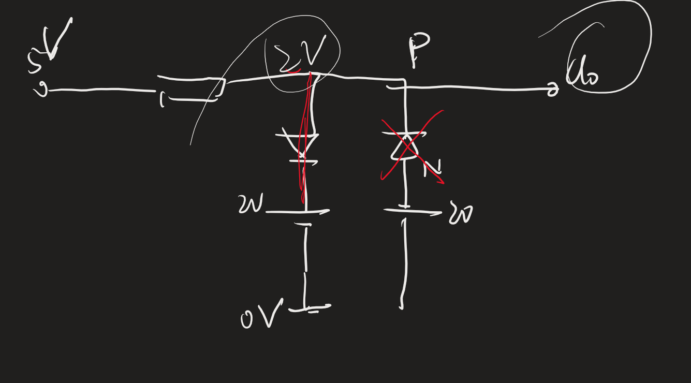
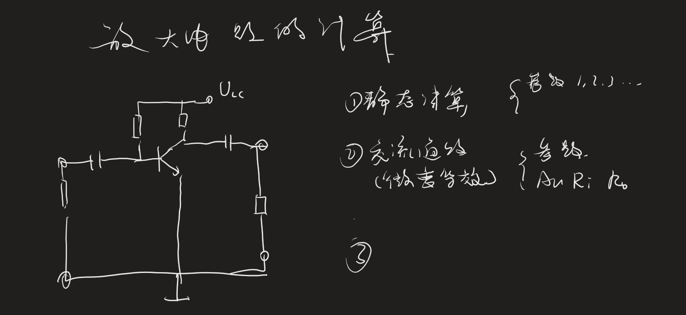
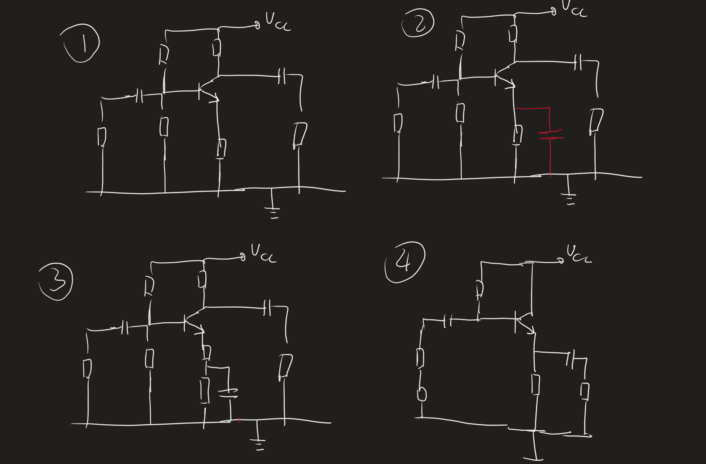
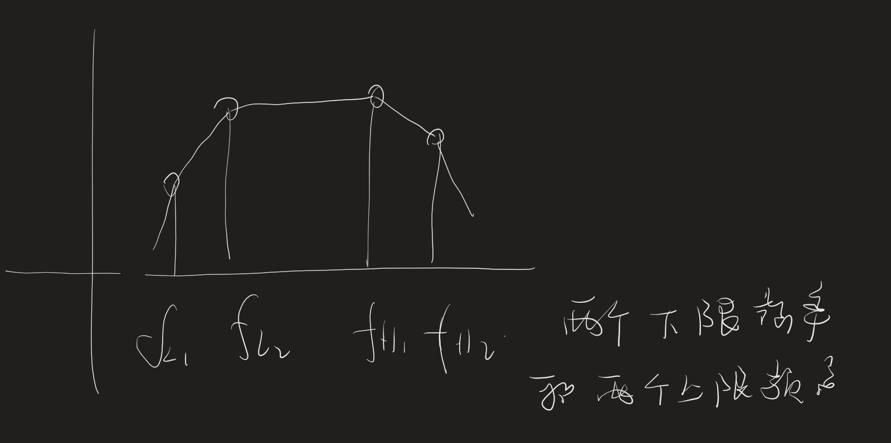
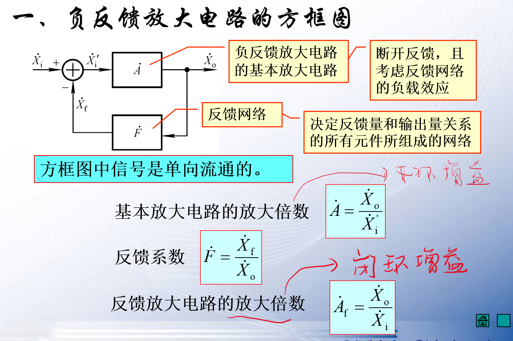

## 1 要求

以自测题和习题为复习标准
P513面具有答案

- 模电的要求
  1. 会看图[考试要求]
  2. 会计算[考试要求]
  3. 会选择元器件（实际运用）
  4. 会调试（修复）
  

## 不考部分

场效应管

## 1 第一章

### 1.1 填空题

**复习方式主要是课后习题**
填空主要是概念性问题
二极管的导通与截至
三极管的工作状态（集电极反偏）
三极管的输出特性有三种工作状态（饱和，放大，截至）
P52 
自测题第一题

### 1.2 大题

P1.2
P1.3 

## 2 第二章（大题）

## 3 第三章

- 差分放大电路
  1. **零点漂移**
  2. **抑制零点漂移的电路：差分放大电路**（共模，差模，比较）
  3. **为什么差分电路可以抑制零点漂移** 
     1. 电路的对称性
     2. 共模抑制电阻（共模反馈电阻）

- 运放 
  - $A_u \to \infty$
  - $r_i \to \infty,r_o \to 0$
  - 共模抑制比
  - 运放的电压传输特性
  - 虚短虚断

## 4 第四章

自测题
作业题
群里面的题目

- 记忆公式
    **P187 
    4.1.3
    P188
    4.1.7**

给波特图写表达式
给表达式画波特图

$$f_L,f_H$$

## 5 第五章

反馈的判断
（电压电流，串联并联）
四个变量三个符号

同相比例运算电路（电压串联负反馈）

1. 判断负反馈的类型
2. 计算F（$F_{uu}$）
3. 计算$A_f = \frac{1}{F}$

{电压并联，电流串联}不好计算

老师PPT（四种电路的计算方法） 第五章P23~P

**只需要做运放**

## 6 第六章

1. 运放运算电路（比例运算，加减法）（教材题目）
2. **根据公式设计电路** $u_O = 5u_{i_1}\pm 3 u_{i_2} - 2 u_{i_3}$ {可以使用多个运放，加法一个，减法一个}
3. 滤波电路（理想滤波电路，电压传输特性，通频带）（HPF,BPF）

## 7 第七章

1. 正弦波正当电路的构成
2. RC,LC,晶振
3. **电压比较器** Core **滞回电压比较器**会画波形

## 8 第八章

甲乙类放大器
最大输出电压，功率，效率

## 9 第九章（计算题）

四个电路

半波整流，桥式整流，分别加滤波电路

计算参数（6个参数）
负载电阻，平均电压，平均电流
群里面的题目