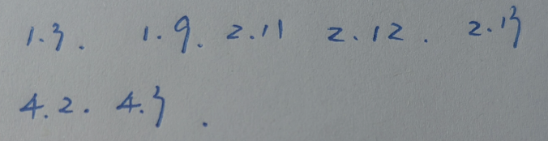
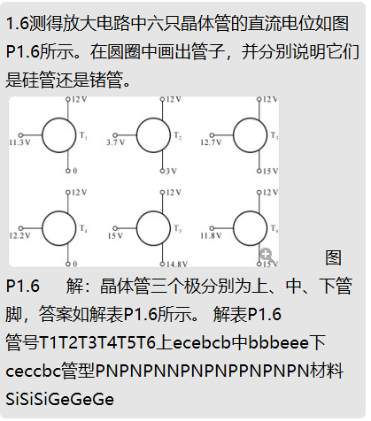
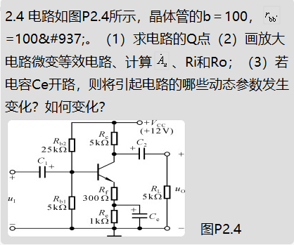
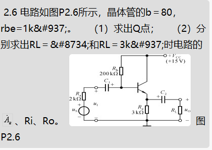
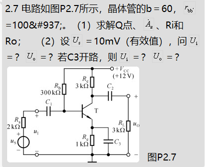
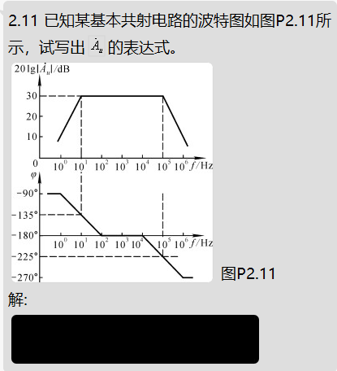
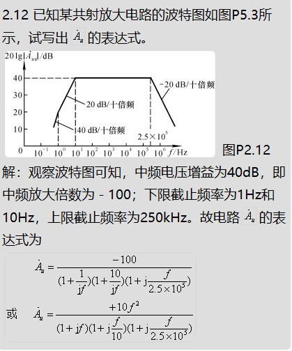
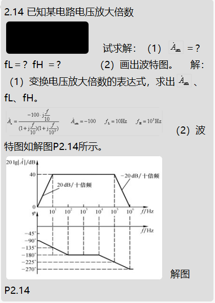

1.1 电路如图P1.1所示，已知ui＝5sin&#969;t (V)，二极管导通电压UD＝0.7V。试画出ui与uO的波形，并标出幅值。

---

1.6测得放大电路中六只晶体管的直流电位如图P1.6所示。在圆圈中画出管子，并分别说明它们是硅管还是锗管。

P1.6     解：晶体管三个极分别为上、中、下管脚，答案如解表P1.6所示。 解表P1.6
管号T1T2T3T4T5T6上ecebcb中bbbeee下ceccbc管型PNPNPNNPNPNPPNPNPN材料SiSiSiGeGeGe

---

2.4 电路如图P2.4所示，晶体管的b＝100，=100&#937;。（1）求电路的Q点（2）画放大电路微变等效电路、计算、Ri和Ro；（3）若电容Ce开路，则将引起电路的哪些动态参数发生变化？如何变化？  

---

 2.6 电路如图P2.6所示，晶体管的b＝80，rbe=1k&#937;。    （1）求出Q点；    （2）分别求出RL＝&#8734;和RL＝3k&#937;时电路的A——u、Ri、Ro

 

 ---

 2.7 电路如图P2.7所示，晶体管的b＝60，=100&#937;。（1）求解Q点、、Ri和Ro；   （2）设＝10mV（有效值），问＝？＝？若C3开路，则＝？＝？ 

 

---

---

