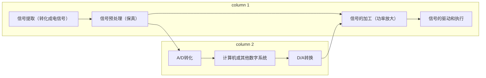

# 引言

## 电气工程和电子信息技术的区别  

**电工用于解决电气设备的，无线通信设备，早期的电子信息工程用于处理电子信息，电气工程用于处理发电，输电，用电。简单来说就是围绕电能展开**，但是电气工程及其自动化，自动化控制早期使用机械结构自动控制，抽水马桶等等。但是当计算机出现的时候，[^1]自动化飞快的发展。  
总的来说  

- 电气工程  围绕电能
- 电子信息  围绕电子信息

## 模拟电子技术  

模拟电子技术很大程度上围绕技术。

- [电子技术的发展](#1)
- [模拟信号与模拟电路](#模拟信号和数字信号)
- 电子信息系统的组成
- 模拟电子技术课程特点
- 如何学习
- 课程目标
- 考察方法

<h2 id="1">电子技术的发展</h2>  

### 电子管的出现  

电子管的出现显然很有意义，它能够表示0-1.我们显然可以用它用于计算。

### 半导体的出现  

贝尔实验室最早研究出来的半导体，同样，集成电路也是贝尔实验室的发明。并且贝尔实验室无私的推广技术。Ge材料使早期的半导体材料，现在大多采用*Si*材料。  
中国因为国际化该技术得以大力发展  

## 模拟信号和数字信号

- 模拟信号-->连续
离散性质
- 数字信号-->0-1

## 电子信息系统的组成  

