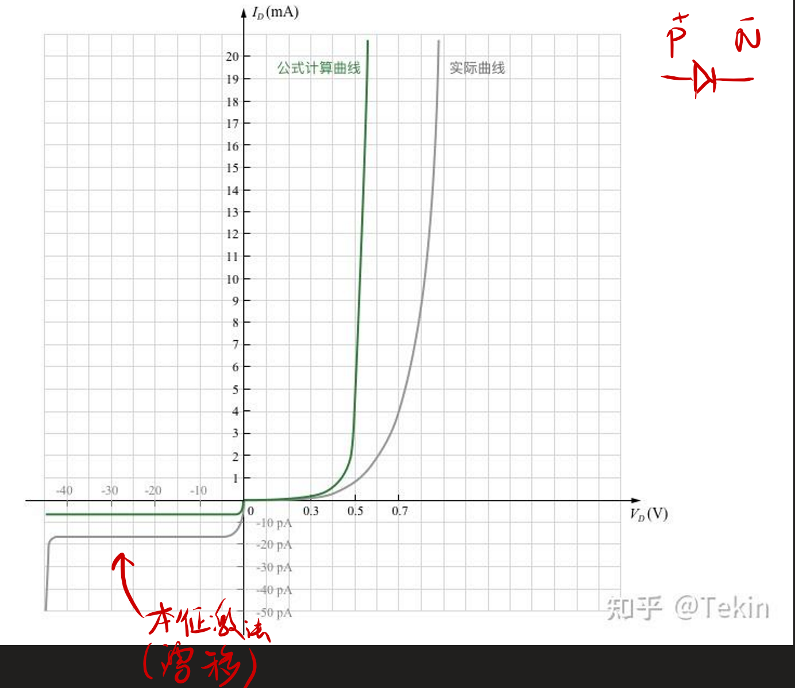
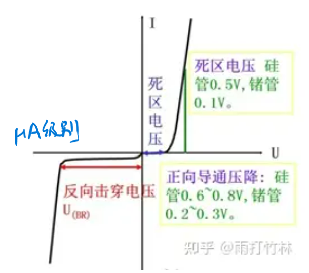
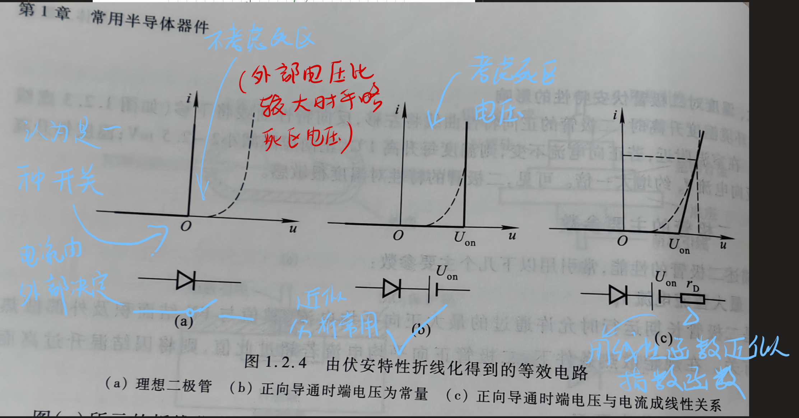
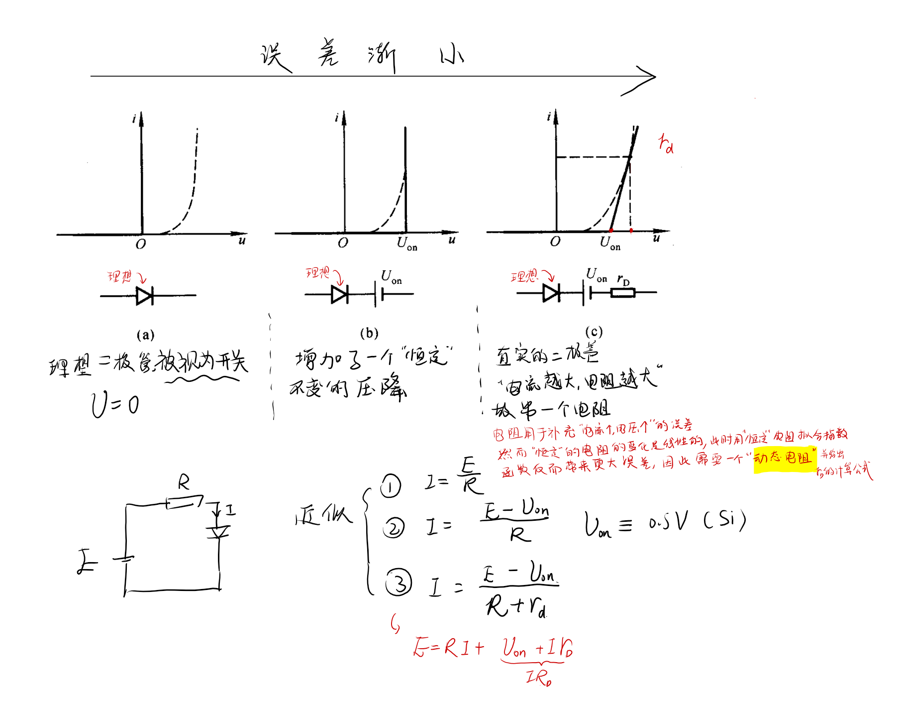
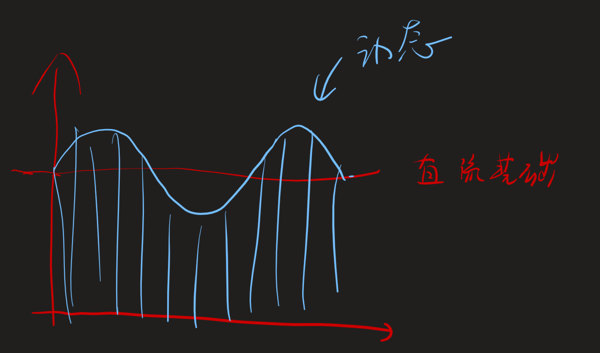

# 半导体二极管  

<!-- @import "[TOC]" {cmd="toc" depthFrom=1 depthTo=6 orderedList=false} -->

<!-- code_chunk_output -->

- [半导体二极管](#半导体二极管)
  - [1.2.1二极管常见结构](#121二极管常见结构)
  - [1.2.2二极管的伏安特性](#122二极管的伏安特性)
  - [1.2.3主要参数](#123主要参数)
  - [1.2.4二极管等效电路](#124二极管等效电路)
    - [二极管微变等效电路](#二极管微变等效电路)
      - [动态电阻，交流电阻](#动态电阻交流电阻)
  - [1.2.5.6 多二极管电路分析](#1256-多二极管电路分析)
  - [1.2.5稳压二极管](#125稳压二极管)
    - [伏安特性](#伏安特性)
    - [主要参数](#主要参数)

<!-- /code_chunk_output -->

---
将PN结进行封装起来，引出两个引脚，形成了二极管。并且对正负极进行标记。两个引脚称为正极和负极。

## 1.2.1二极管常见结构  
- 点接触型（高频二极管）
- 面接触型（整流二极管，大电流）
- 平面型

## 1.2.2二极管的伏安特性  

*死区电压就是开启电压，具体值难以预测*

- 反向击穿
  - 雪崩击穿
  - 齐纳击穿

我们总结出了一个经验公式（开启电压后）
$$i =I_S(e^{\frac{u}{U_r}}-1)$$
半导体材料受到温度影响很大，所以不同环境，不同温度下曲线都可能变化。
死区电压会产生压降
导通后非理想二极管也会有导通压降

## 1.2.3主要参数

- 最大整流电流$I_F$：最大平均值
- 最大反向工作电压$U_R$：最大瞬时值
- 反向电流$I_R$（漂移作用，非常小，反应二极管质量）
- 最高工作频率

## 1.2.4二极管等效电路

- 开关
- 开关 + 电源
- 开关 +电源 + **动态**电阻

当电路中二极管两侧电压远大于启动电压，二极管计算可以简化成理想二极管，误差较小

:stars:

### 二极管微变等效电路

二极管的电路为非线性电路，高次电路，我们使用图解法。

首先当二级管画正向电压并且导通时，将会有电流，（该点对应为Q点）此时可以计算出一个电阻$r_d$，若在此时给一个微小的变化量，可以以用该点的切线今昔计算，**在这个微小的范围中**二极管等效为一个*动态电阻*$r_d=\frac{\Delta u_D}{\Delta i_D}$整体电路称为：二极管微变等效电路

显然不同的微小范围对应的动态电阻不同
由于用直线拟合指数函数所以只在**微小范围**内有用

$$\begin{aligned}\frac1{r_\mathrm{d}}&=\frac{\Delta i_\mathrm{D}}{\Delta u_\mathrm{D}}\approx\frac{\mathrm{d}i_\mathrm{D}}{\mathrm{d}u_\mathrm{D}}=\frac{\mathrm{d}[\left.I_\mathrm{S}(\mathrm{e}^{\frac u{U_\mathrm{T}}}-1)\right.]}{\mathrm{d}u}\end{aligned}\approx\frac{I_S}{U_T}\cdot e^{\frac{u}{U_T}}\approx\frac{I_D}{U_T}$$
$$r_{\mathrm{d}}\approx\frac{U_{\mathrm{T}}}{I_{\mathrm{D}}}$$
当我们将这个微小的变动作为一个正弦输入量，将会得到：

**微变等效电路显然只能在微小的信号波动才能发挥作用**
在这种电路中，电流有两个分量
$$I=I'+i'=\frac{E}{R}+\frac{u_i}{R+r_D}$$
#### 动态电阻，交流电阻
$R= \frac{\Delta U}{\Delta I}$我们在动态分析中，非线性关系（第一个馒头救命，第二个馒头不饿，第三个馒头开心，同样的馒头作用不同）动态是基于直流，**动态的动是基于静态之上**。

此时总体上依然是直流，只不过存在交流信号。此时二极管在这个动态电路中对小的交流信号产生作用。
**综上所述：二极管对直流和交流的反应不同**
**以上的交流都基于直流的基础上**

## 1.2.5.6 多二极管电路分析

**看共阳接法**

## 1.2.5稳压二极管

稳压二极管是使用接触面型的二极管，反向时候，端电压几乎不变，呈现稳压特性。

### 伏安特性

**稳压**：当击穿电流变化时候由于接近直线，所以电压变化很小，即**动态电阻**非常小，显然存在稳压作用

### 主要参数

1. 稳定电压
2. 稳定电流

