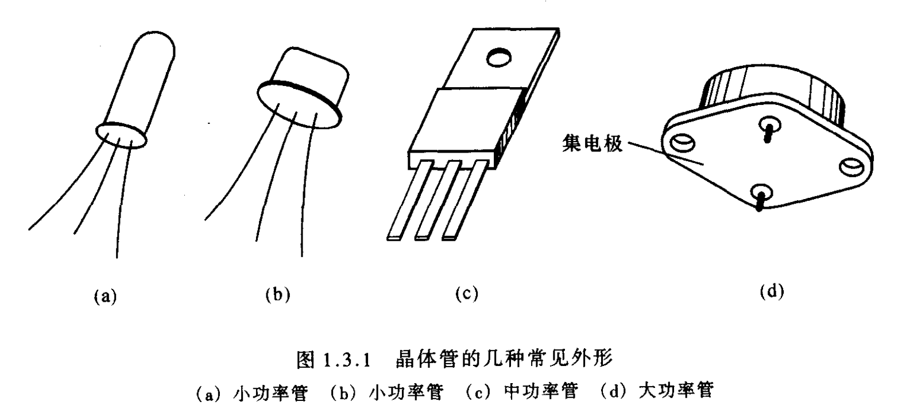
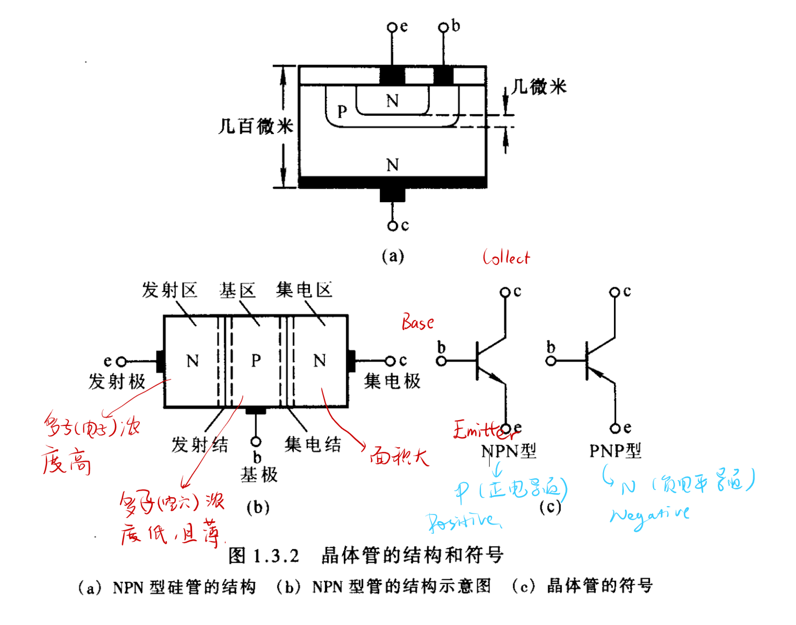
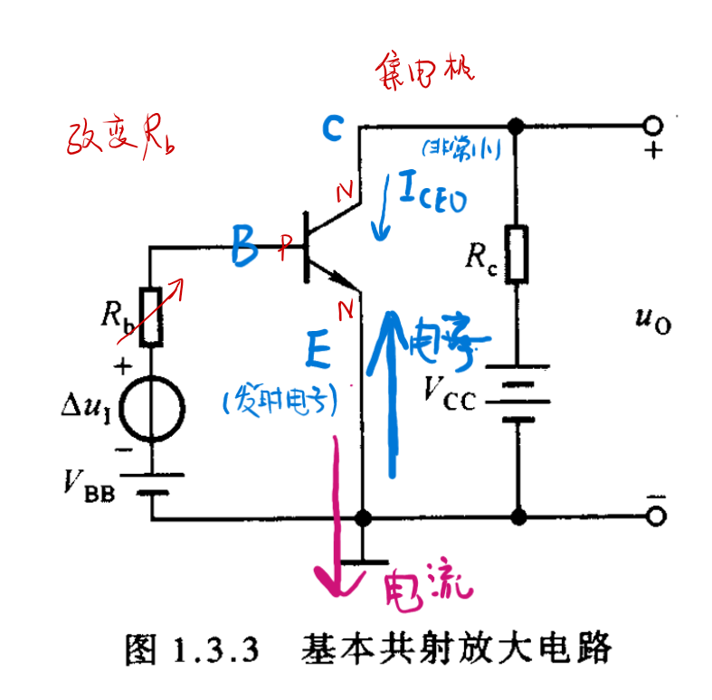
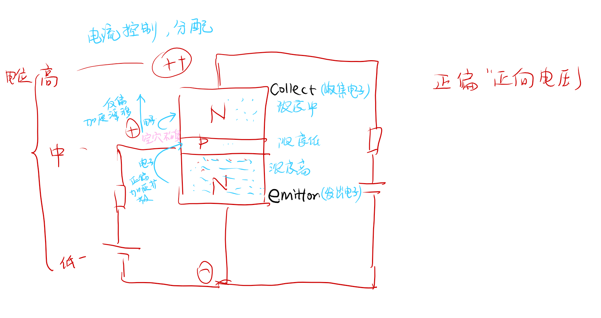
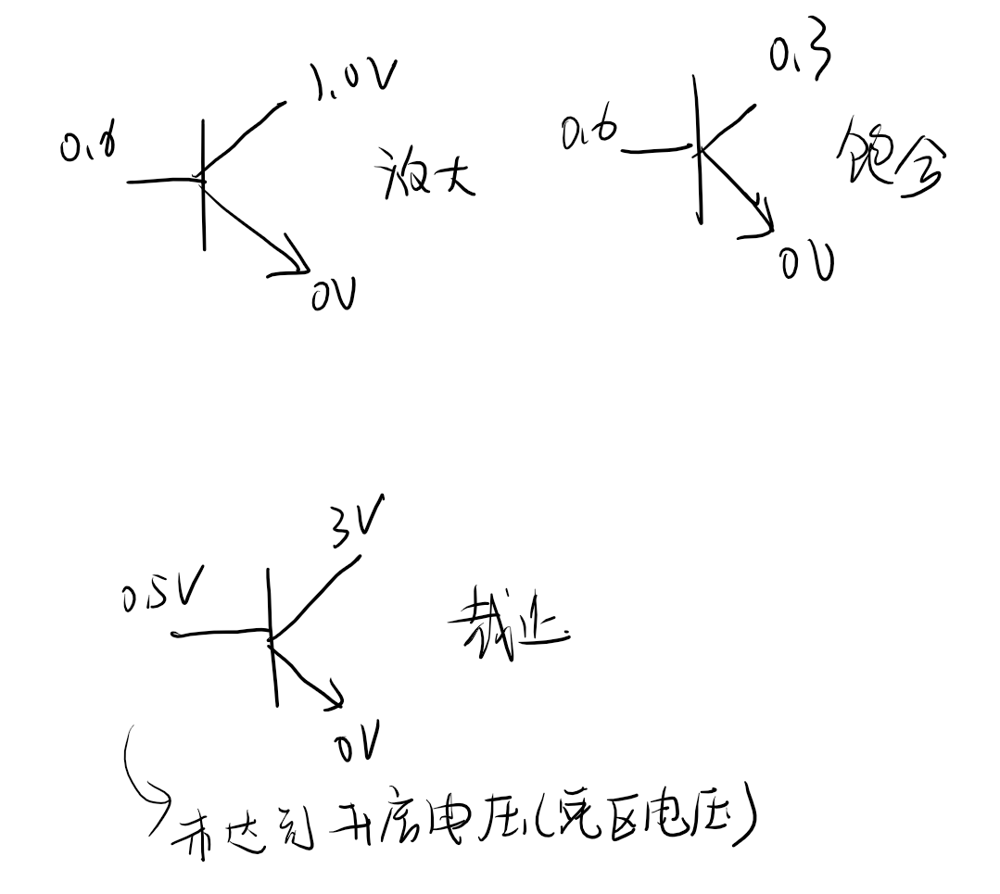
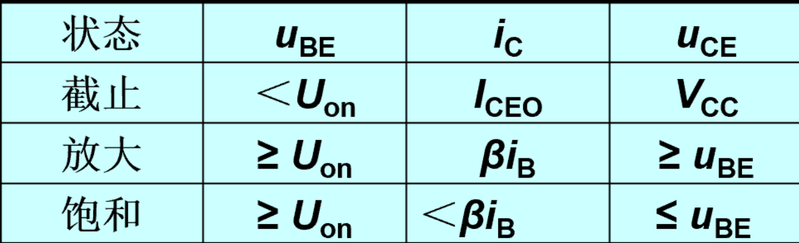

# 三极管

## 晶体管的结构和符号

- NPN型
- PNP型

## 1.3.2三极管的放大电路

实验现象，
我们对b集电极通电并且改变$R_b$的电阻

|$R_b$|$\infty$|||
|---|---|---|---|---|
|$I_B$|0|1|2|3|
|$I_C$|0|50|100|200|
|$I_E$|0|51|102|203|
实际情况没这么好看

现象解释

三极管放大电路基本要求：**发射极正向偏置，集电极反偏**
该放大电路有一个放大系数：
交流放大系数$\boldsymbol{\beta}=\frac{\Delta\boldsymbol{i}_\mathrm{c}}{\Delta\boldsymbol{i}_\mathrm{B}}$
直流放大系数$\overline{\beta}=\frac{I_{CN}}{I_{B}^{\prime}}=\frac{I_{C}-I_{CBO}}{I_{B}+I_{CBO}}$
**值得注意的是，这两个系数并不是确定的，二十在一个范围内波动。**
穿透电流和集电结反向电流有以下关系：

穿透电流非常小，接近0。

## 1.3.3 三极管的共射特性曲线
### 输入特性（输入端的电压迪纳留关系）
$$i_{_{B}}=f(\left.u_{_{BE}}\right)\Bigg|_{U_{_{CE}}=\text{常数}}$$

记住$\geq 1V$的那一根，此曲线和二级管伏安特性类似。
### 输出特性
$$i_{\mathrm{C}}=f(u_{CE})\Bigg|_{I_{\mathrm{B}}=\text{常数}}$$

### 1.3.4 三极管的主要参数

1

### 1.3.5 温度对特性的影响
**我们认为$\beta$值不会变**

## 三极管的三种状态
- 状态
  - 饱和（两个正偏）
  - 截止（基极未达到开启电压）
  - 放大

