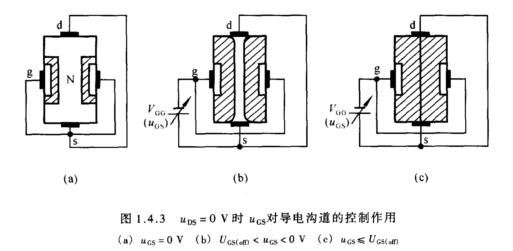
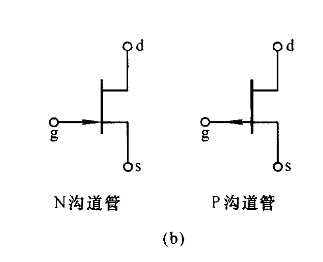
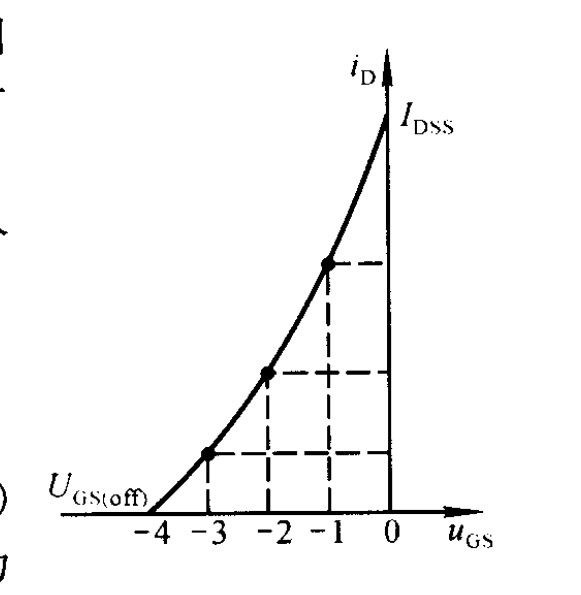
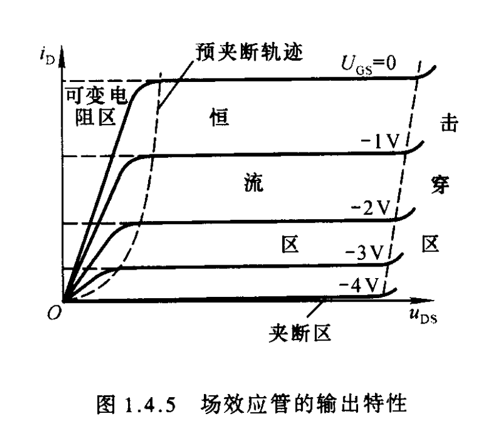

# 场效应管 

<!-- @import "[TOC]" {cmd="toc" depthFrom=1 depthTo=6 orderedList=false} -->

<!-- code_chunk_output -->

- [场效应管](#场效应管)
  - [1. 结构](#1-结构)
  - [2. 特性](#2-特性)
    - [2.1 转移特性](#21-转移特性)
    - [2.2 输出特性](#22-输出特性)

<!-- /code_chunk_output -->

## 1. 结构

沟道夹断

## 2. 特性 

### 2.1 转移特性  

### 2.2 输出特性  

