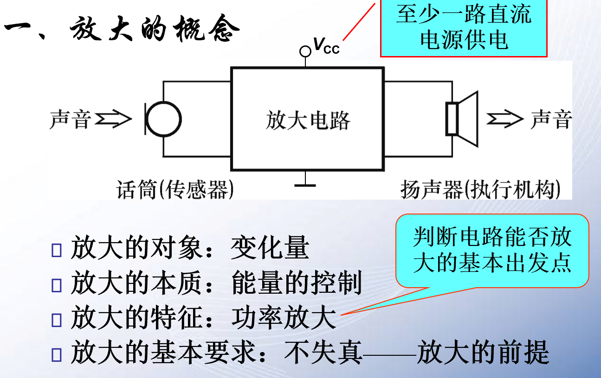
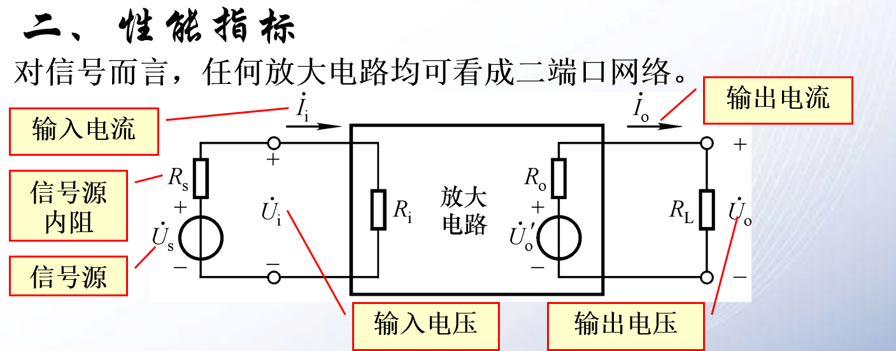
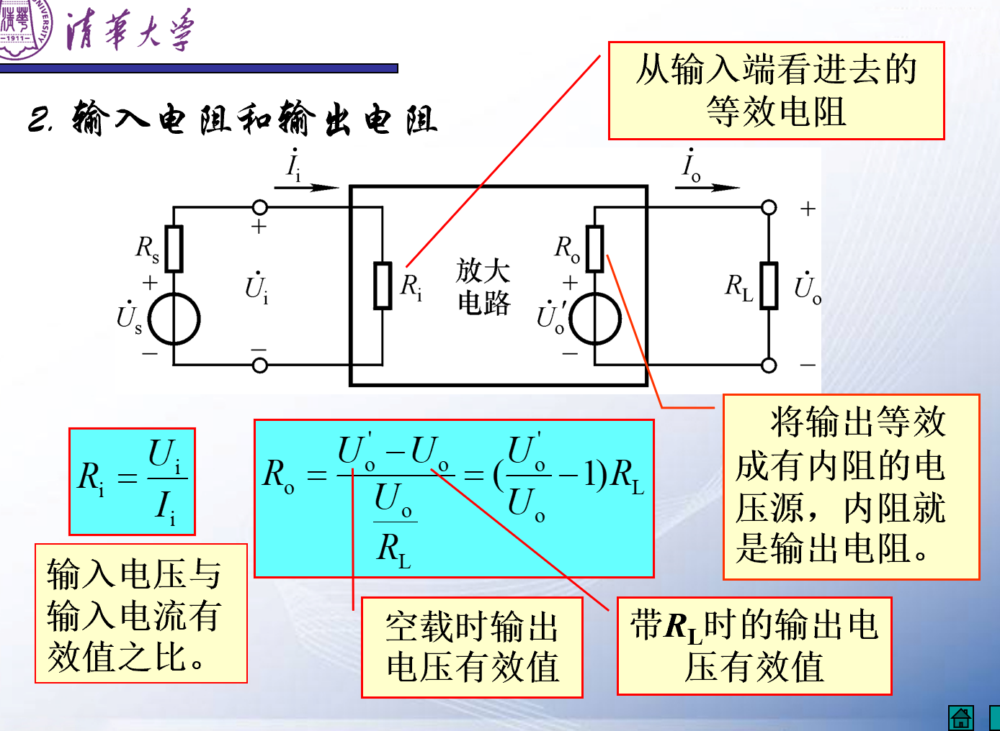
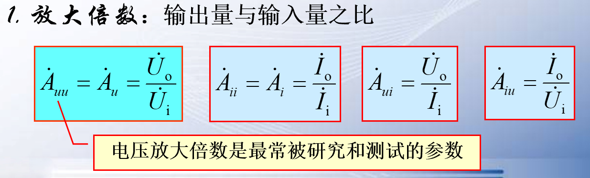
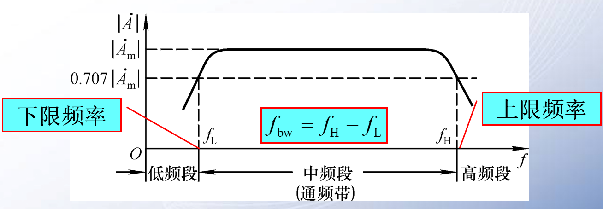

<!-- @import "[TOC]" {cmd="toc" depthFrom=1 depthTo=6 orderedList=false} -->

<!-- code_chunk_output -->

- [2.1.1放大的概念](#211放大的概念)
- [2.1.2性能指标](#212性能指标)
  - [1.放大倍数](#1放大倍数)
  - [2.输入电阻](#2输入电阻)
  - [3.输出电阻](#3输出电阻)
  - [4.通频带](#4通频带)

<!-- /code_chunk_output -->

---
## 2.1.1放大的概念

放大是一种能量的变化

- 放大的基本要求
  - 保真

## 2.1.2性能指标

- 放大倍数
- 输入电阻
- 输出电阻
- 通频带

### 1.放大倍数

### 2.输入电阻  

信号源给出**放大电路**一个$\overset{.}{I_i}$和$\overset{.}{U_i}$,我们得出一个负载电阻：$R=\frac{\overset{.}{U_i}}{\overset{.}{I_i}}$
我们也称之为**输入电阻**,输入电阻是站在放大电路的角度，针对不同的信号源而确定的。输入电阻匹配的时候功率传输效率最大。

### 3.输出电阻

放大电路时输出端的电源，则他有一个内阻，橙汁为**输出电阻**，**输出电阻**时放大电路相对于输出电路而言的。

### 4.通频带  

衡量放大器对不同频率的信号的适应能力。

