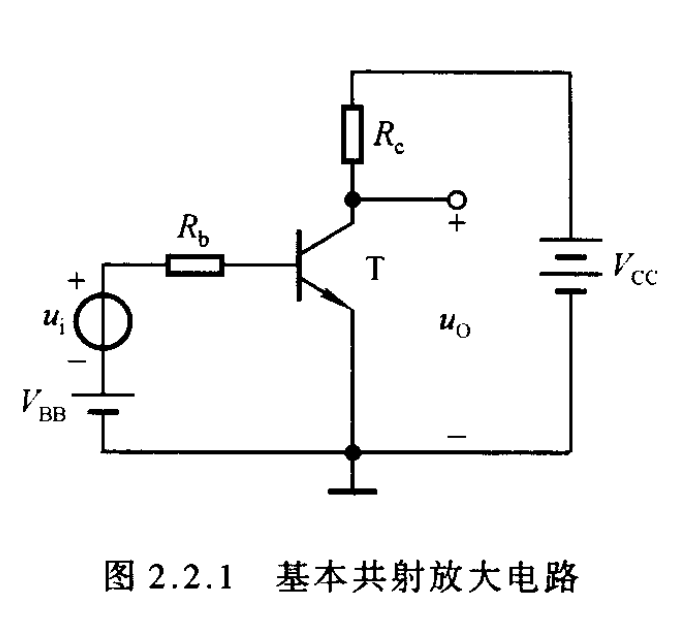
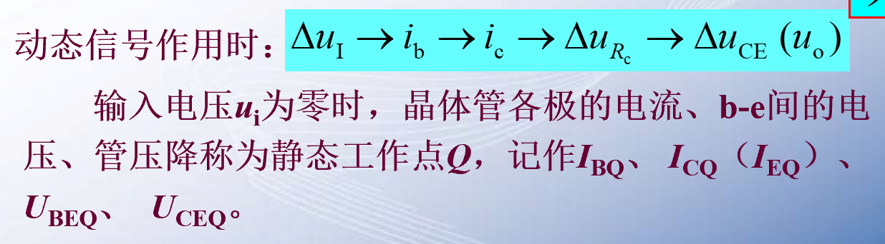
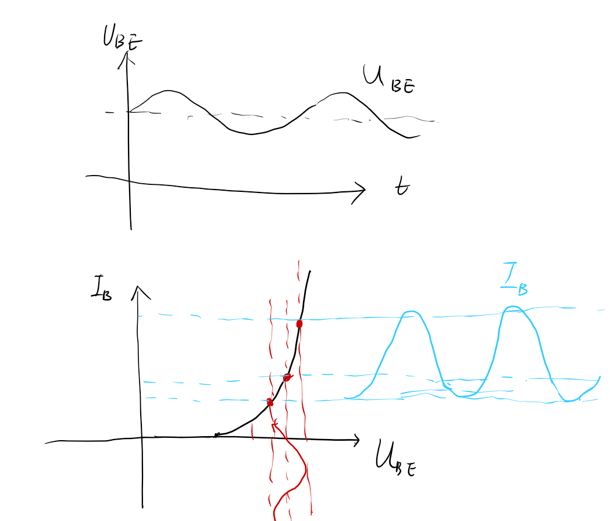
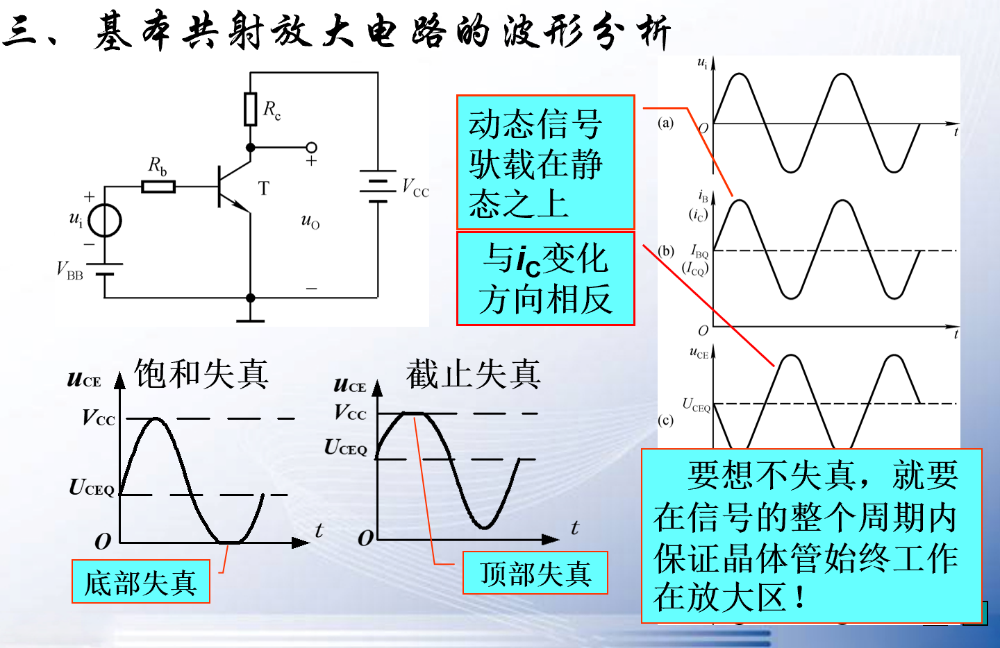
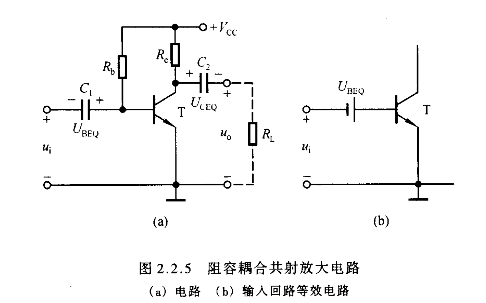
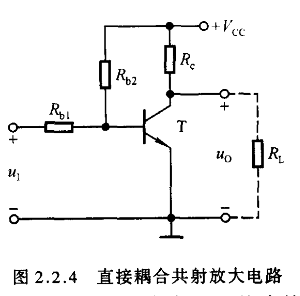

## 2-2-1电路的组成

$V_{BB},R_b$:开启三极管，并且给出合适的$I_B$
$V_{CC}$:能量提供
$R_C$:将$\Delta i_C$转化为$\Delta u_{CE}(u_0)$否则输出端始终等于$V_{CC}$

## 2-2-2静态工作点

**交流的起点**交流是基于直流的，所以直流被称为静态工作点。只有直流存在时交流信号的变化才会引起放大变化。
静态工作点需要设置到线性变化区域，否则会失真。所以**设置静态工作点**是鹅肥腻重要。

## 2-2-3 波形分析

## 2-2-4 放大电路的组成原则

- 合适的静态工作点
- 合适的动态信号
- 对于实际的电路
  - 共地
  - 直流电源少

#### 2-2-4-1 交流放大电路（阻容耦合）

只能对交流信号进行放大，因为存在容抗问题,需要频率比较高。

**阻容耦合**耦合电容就是将信号在两个体系之中传递的作用。
[耦合电容](https://blog.csdn.net/qq_38636482/article/details/125280489)

#### 2-2-4-2 直流放大电路（直接耦合）

直流耦合电路，效率很低，交流信号大部分在$R_B$电阻上小号的很多，原则上直接耦合的使用范围很广，可以用于放大直流信号和低频交流信号，这都是阻容耦合所做不到的。直接耦合显然需要很强的设计和计算才能很好的运用。

