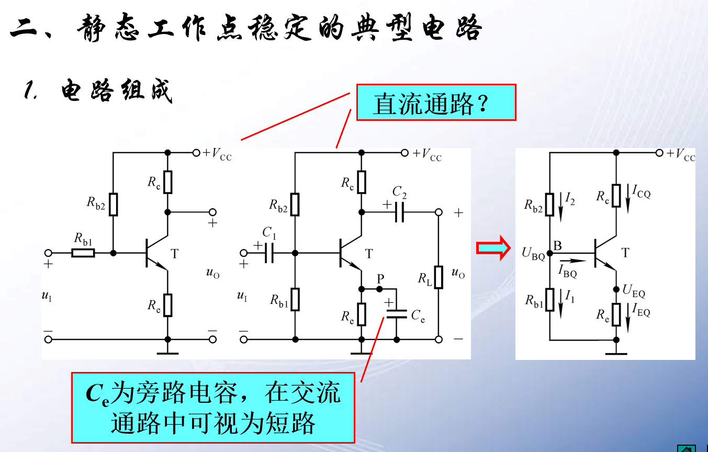
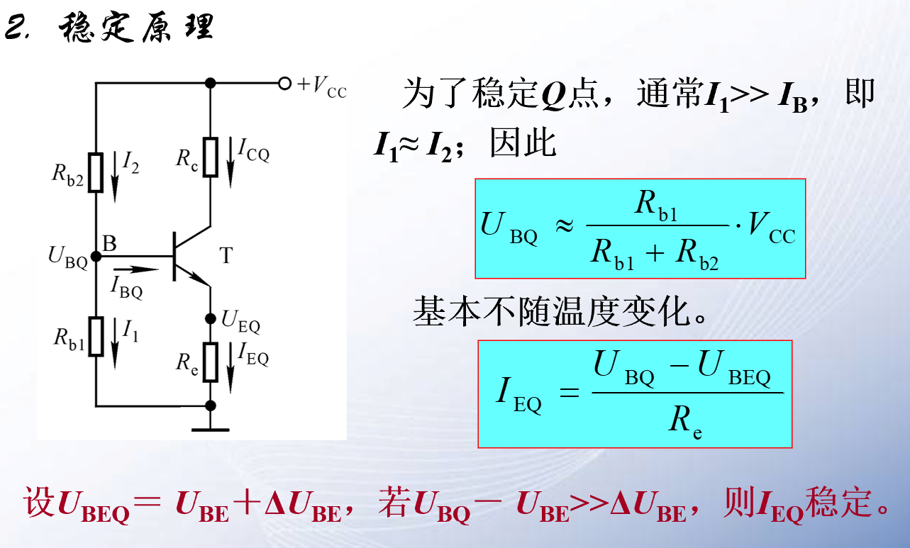

## 1 温度对放大电路的影响

## 2 稳定静态工作点
由于本征激发一直存在，则放大电路的电流很大程度上受到温度的影响。
所以我们设计我们设计了一些电路，用来减少这种干扰。
有一些电路静态工作点比较稳定

分压是偏置电路

**静态工作点就是偏置。偏置电路，上述的电路称为分压是偏置电路。**

稳定静态工作点的方法可以添加发射极电容
1. 电阻分压
2. 发射极电容
3. 热敏电阻
4. 利用二极管的反向电流（本征激发）
5. 总之能造成$U_{BC}$电压减小