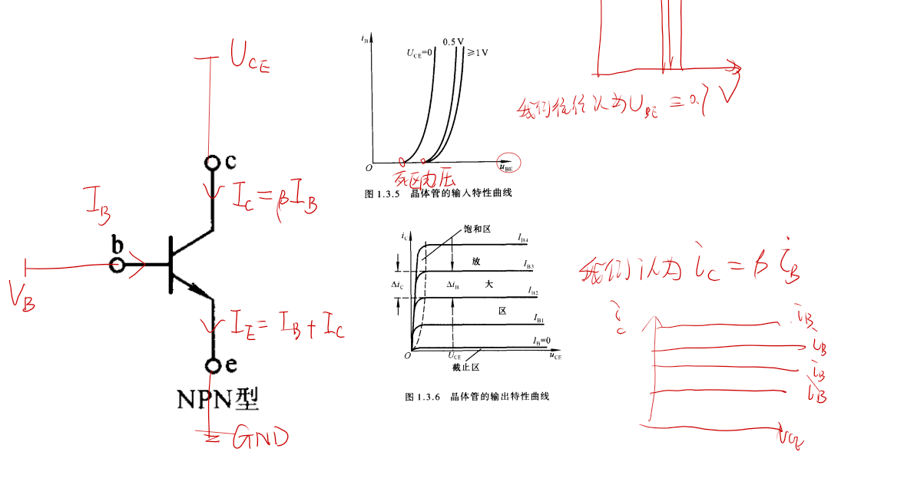
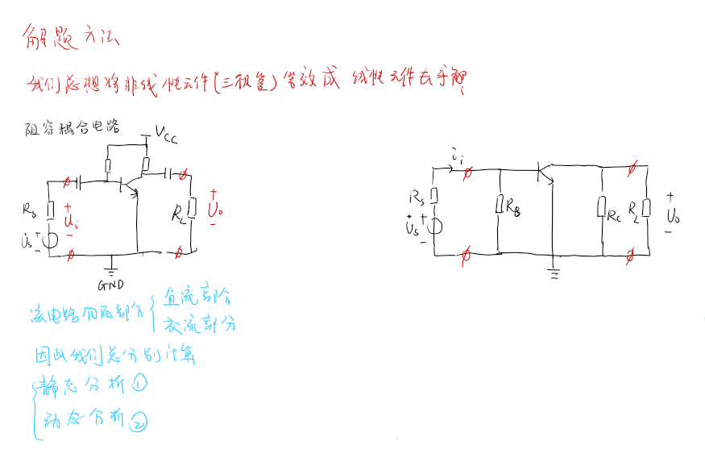
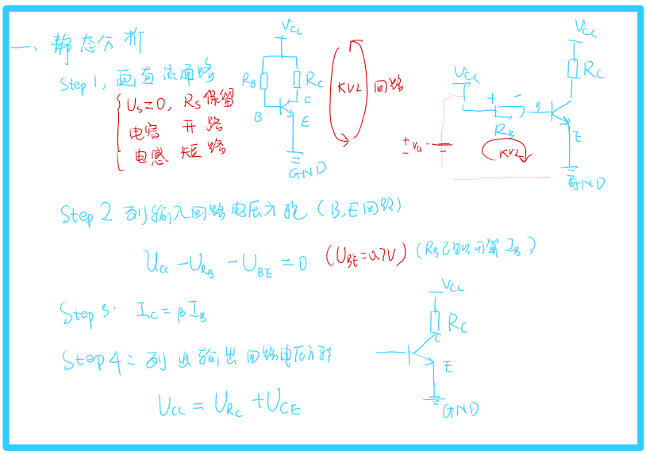
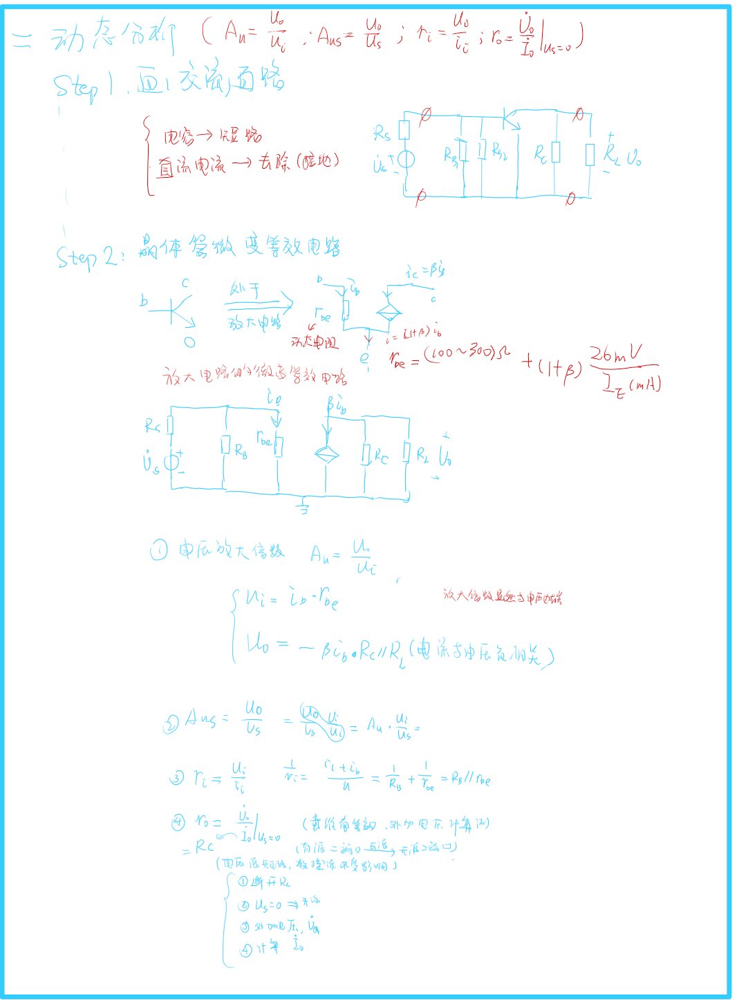
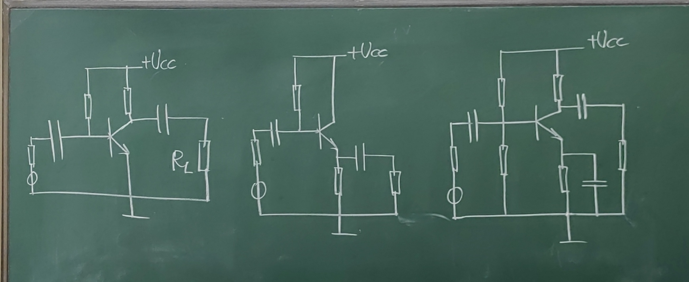
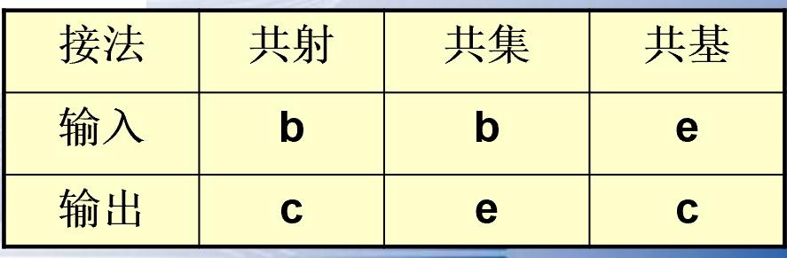
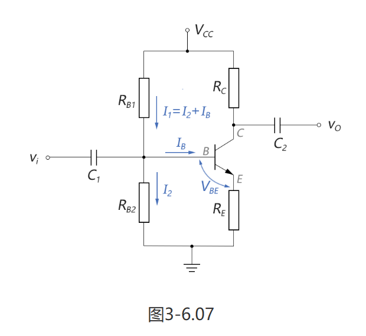
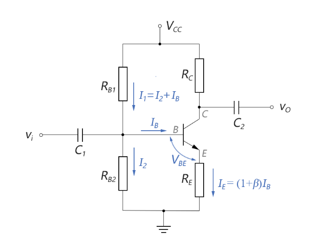

# 放大电路的总结
- [放大电路的总结](#放大电路的总结)
  - [1 三极管复习](#1-三极管复习)
  - [2 通用分析方法](#2-通用分析方法)
  - [3 常见的静态工作点稳定电路](#3-常见的静态工作点稳定电路)
    - [3.1 分压偏置共射放大电路](#31-分压偏置共射放大电路)
      - [3.1.1 近似计算](#311-近似计算)
        - [3.1.1.1 输入分析](#3111-输入分析)
        - [3.1.1.2 输出分析](#3112-输出分析)
      - [3.1.2 精确分析法](#312-精确分析法)
  - [4 三种常见放大电路的比较](#4-三种常见放大电路的比较)

><https://blog.csdn.net/weixin_49284870/article/details/112250686>
>https://www.cnblogs.com/initcircuit/p/11703235.html
---

## 1 三极管复习

## 2 通用分析方法

**注意串联的电阻电流必须相同！才能进行等效。**

## 3 常见的静态工作点稳定电路

1. 基本的放大电路
2. 射极跟随器
3. 分压式共射放大电路

### 3.1 分压偏置共射放大电路

#### 3.1.1 近似计算

##### 3.1.1.1 输入分析

上图中，由于IB为微安级，而I1和I2都为毫安级，因此，可以近似认为：$I_1≈I_2$。

$$V_{B}=\frac{R_{B2}}{R_{B1}+R_{B2}}V_{CC}$$
$$V_{E}=V_{B}-V_{BE}=\frac{R_{B2}}{R_{B1}+R_{B2}}V_{CC}-0.7V$$

 至于$I_B$，由于我们刚才已经将$I_B$近似为$0$了，故这里$I_B$就无法再计算了。好在近似分析法中，即使我们不计算$I_B$，也不影响后面的“输出静态工作点”的计算。

##### 3.1.1.2 输出分析

由于在近似分析法中，IB已经近似为0，就不能用IC=β IB这个公式来计算IC了。我们需要用别的方法来计算IC，看下图：

$$V_{E}=V_{B}-V_{BE}=\frac{R_{B2}}{R_{B1}+R_{B2}}V_{CC}-0.7V$$

$$I_{E}=\frac{V_{E}}{R_{E}}=(\frac{R_{B2}}{R_{B1}+R_{B2}}V_{CC}-0.7\mathrm{V})\cdot\frac{1}{R_{E}}$$
$$I_{C}\approx I_{E}=(\frac{R_{B2}}{R_{B1}+R_{B2}}V_{CC}-0.7\mathrm{V})\cdot\frac{1}{R_{E}}$$

$$V_{CE}=V_{CC}-I_CR_C-I_ER_E\approx V_{CC}-I_C(R_C+R_E)$$

#### 3.1.2 精确分析法
在精确分析法中，不再将IB近似为0，而是列出详尽的回路方程，然后进行数值解，如下图所示：（VBE仍简化为0.7V）

$$\begin{cases}I_1=I_2+I_B\\[2ex]V_B=V_E+0.7\text{V}\end{cases}$$

$$\begin{aligned}I_1&=\frac{V_{CC}-V_B}{R_{Bl}}\\I_2&=\frac{V_B}{R_{B2}}\\\\V_E&=I_ER_E=(1+\beta)I_BR_E\end{aligned}$$

$$\begin{cases}\dfrac{V_{CC}-V_B}{R_{B1}}=\dfrac{V_B}{R_{B2}}+I_B\\V_B=(1+\beta)I_BR_E+0.7\text{V}\end{cases}$$

仅含有VB和IB两个未知变量,最终可解得为：
$$I_B=\frac{V_{CC}\frac{R_{B2}}{R_{B1}+R_{B2}}-0.7\mathrm{V}}{(1+\beta)R_E+\frac{R_{B1}R_{B2}}{R_{B1}+R_{B2}}}$$

用IC=β IB的关系式，可以很方便地求出输出端的静态工作点IC和VCE

## 4 三种常见放大电路的比较

1. 基本的放大电路
2. 射极跟随器（共集电极，射随器$U_i = U_0$输出电压等于输入电压）
3. 分压式共射放大电路
4. 

