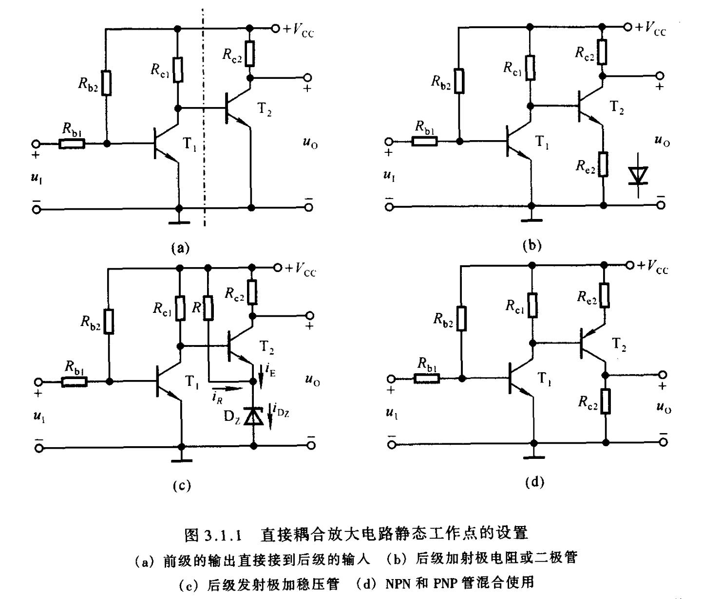
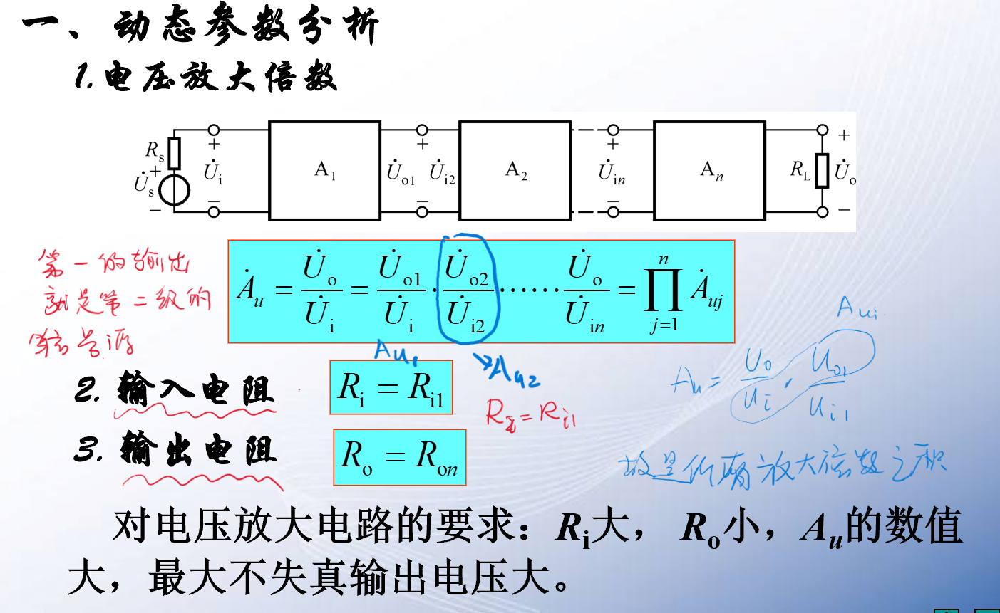
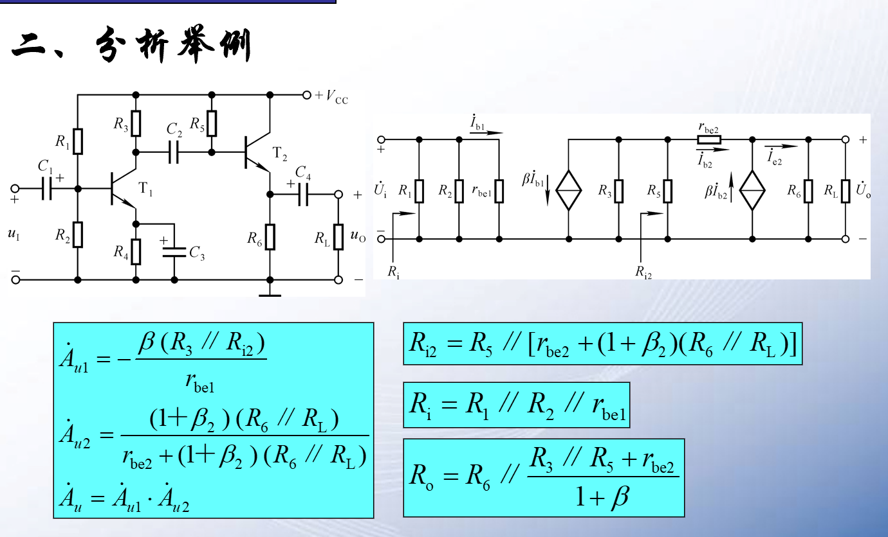

# 多级放大

<!-- @import "[TOC]" {cmd="toc" depthFrom=1 depthTo=6 orderedList=false} -->

<!-- code_chunk_output -->

- [多级放大](#多级放大)
  - [1 多级放大的耦合方式](#1-多级放大的耦合方式)
    - [1.1 直接耦合](#11-直接耦合)
  - [2 动态参数分析](#2-动态参数分析)

<!-- /code_chunk_output -->

---
## 1 多级放大的耦合方式

### 1.1 直接耦合  

## 2 动态参数分析  

输出电阻 $\frac{r_{be}}{\beta}$(近似计算)

**放大电路的内阻越小能提供的电流也就越大**