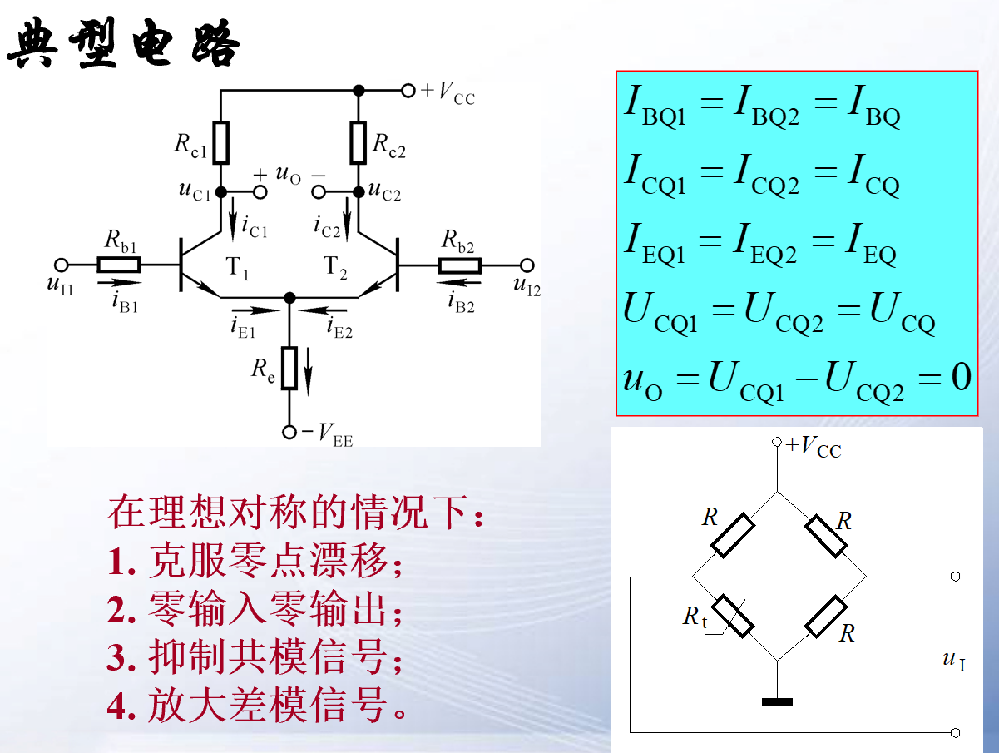
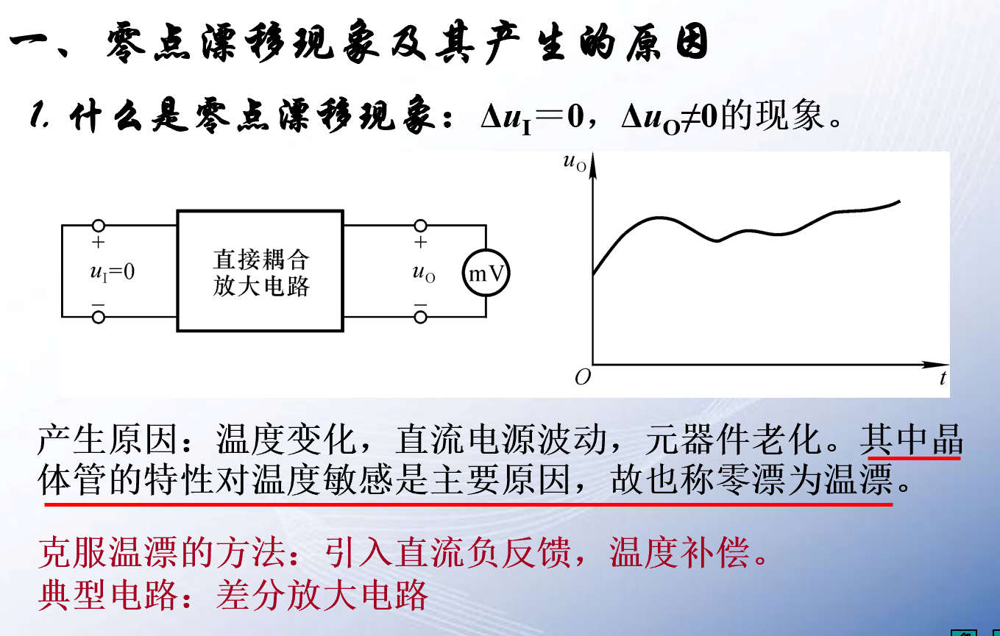
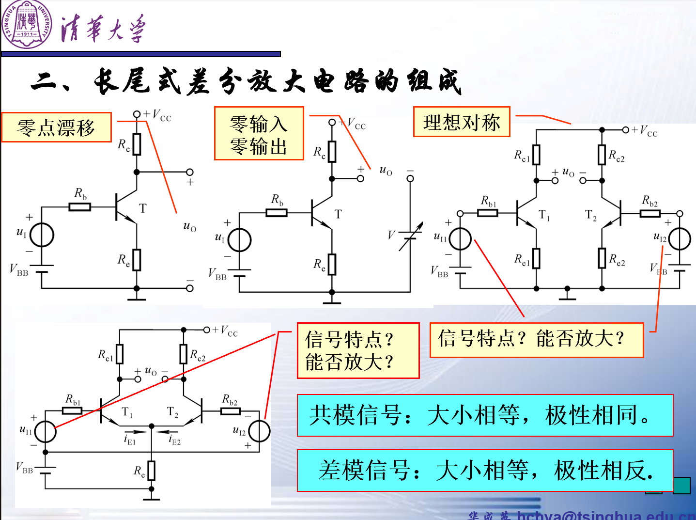
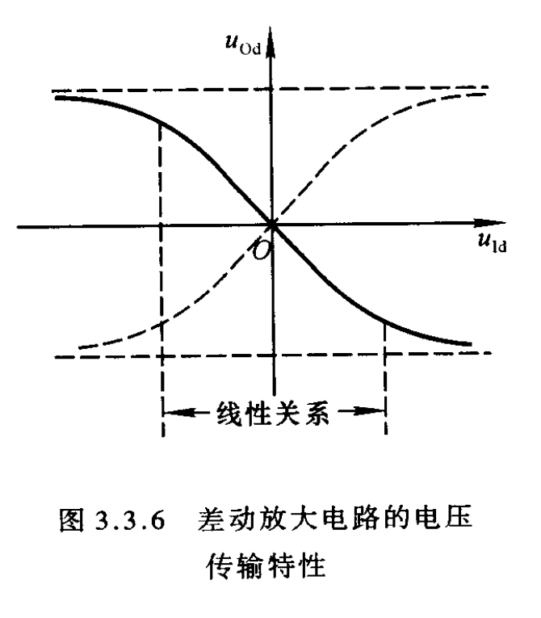
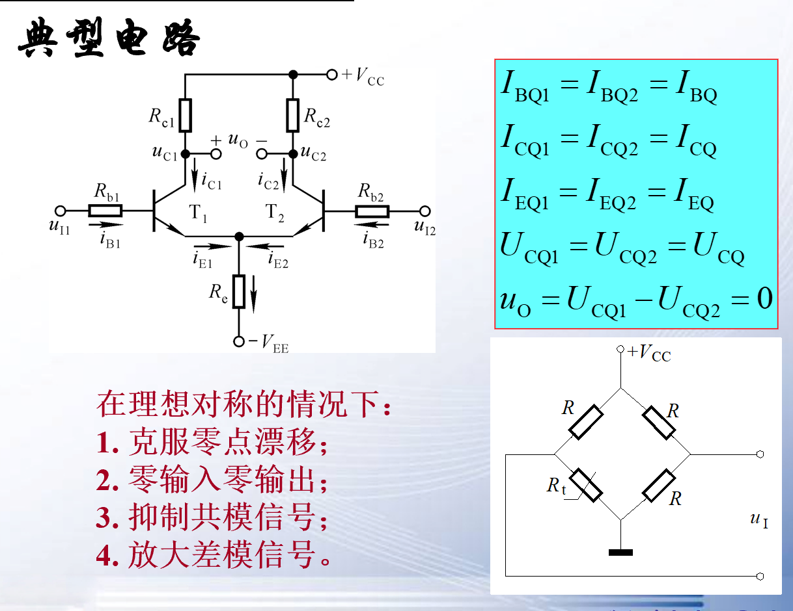
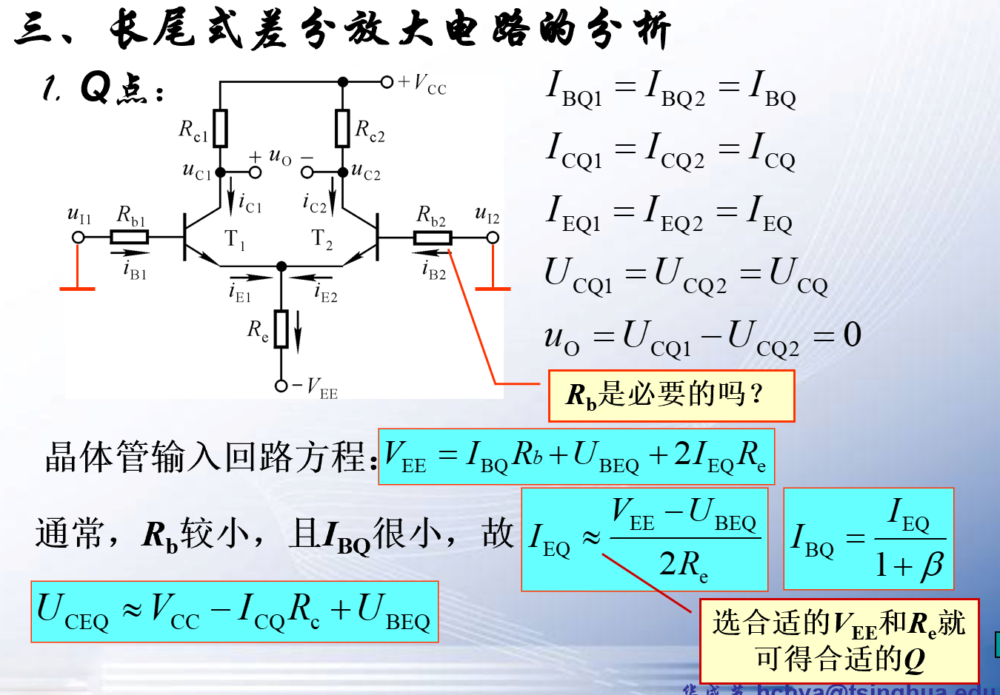
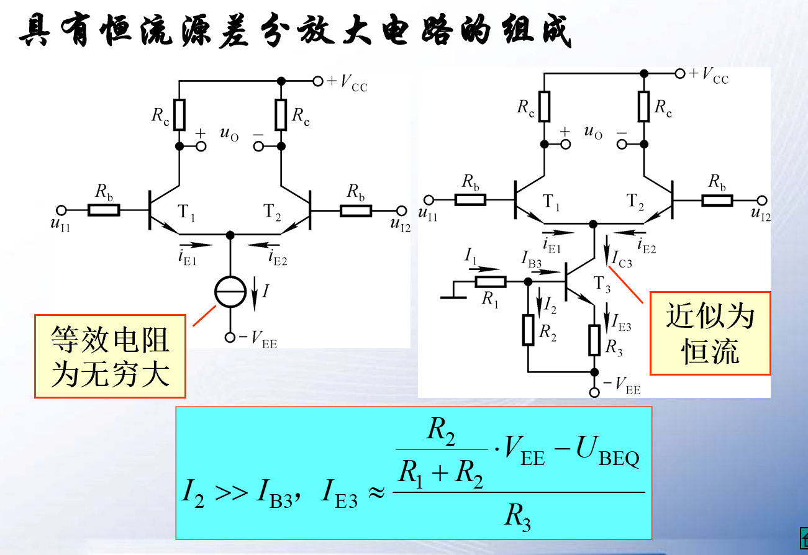
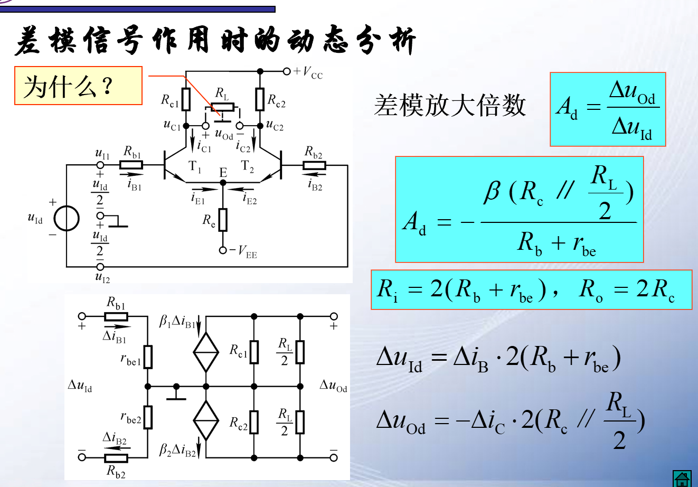
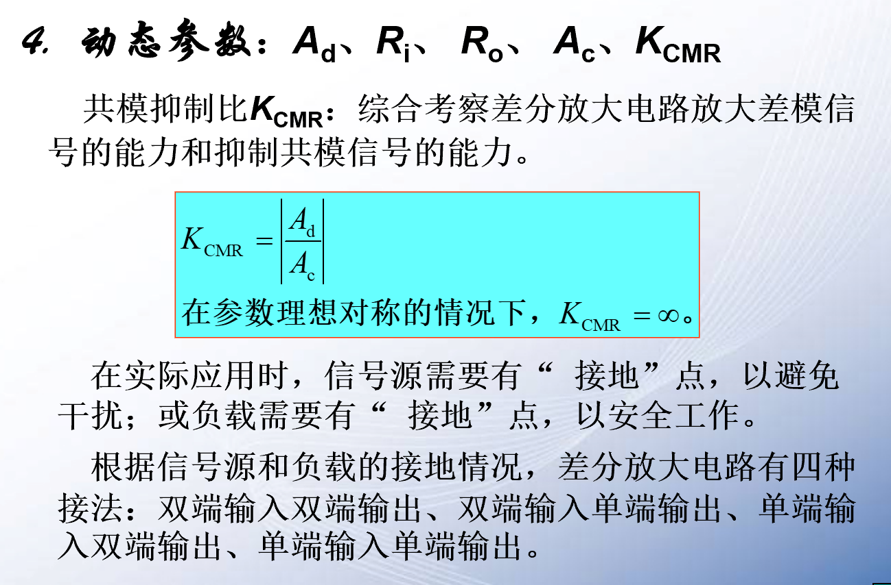
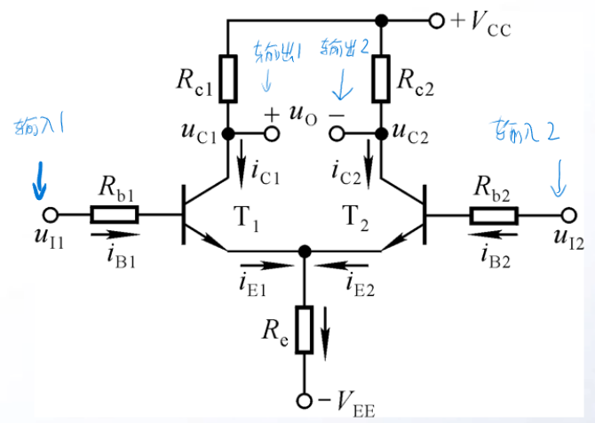

# 差分放大电路

差模，共模，比较  

<!-- @import "[TOC]" {cmd="toc" depthFrom=1 depthTo=6 orderedList=false} -->

<!-- code_chunk_output -->

- [差分放大电路](#差分放大电路)
  - [1 差分放大电路](#1-差分放大电路)
  - [2 零点漂移现象](#2-零点漂移现象)
  - [3 差分放大电路的组成](#3-差分放大电路的组成)
  - [4 电压输出特性](#4-电压输出特性)
  - [5 常见的电路组成](#5-常见的电路组成)
    - [5.1 长尾式差分放大电路的组成](#51-长尾式差分放大电路的组成)
    - [5.2 长尾式差分放大电路的分析](#52-长尾式差分放大电路的分析)
    - [5.3 长尾式差分放大电路动态分析](#53-长尾式差分放大电路动态分析)
    - [5.4 动态参数](#54-动态参数)

<!-- /code_chunk_output -->

---

**为了解决直接耦合的零点漂移问题我们提出了差分放大电路**

## 1 差分放大电路  
两边同时温度影响造成影响，但是他们的差值始终稳定。

**差分放大电路往往作为运放的第一级放大，用于稳定静态工作点减少零点漂移带来的影响。**

## 2 零点漂移现象

**第一级的三极管对放大电路的影响最大**
温度变化，电源电压等外部因素都会影响，而且第一级受到的波动会被后面的放大电路放大。因此零点会漂移。

==零点漂移的本质就是静态工作点不稳定==
我们可以采取分压式偏置电路，温度补偿，二极管补偿等方法进行修正。总之我们可以通过 **设置稳定静态工作点**来减少零点漂移的影响。

## 3 差分放大电路的组成

1. 差模信号:$u_{11} = - u_{22}$
2. 共模信号:$u_{11}  = u_{22}$
3. 比较信号:$u_{11} \neq \pm u_{22}$

==**比较 = 差模 + 共模**==
除了差模和共模信号之外的都叫做共模信号。

## 4 电压输出特性

## 5 常见的电路组成  

### 5.1 长尾式差分放大电路的组成

该电路只能放大差模信号，共模信号输出为0。如果输入为比较信号，而比`较信号=差模信号+共模信号`  共模分量变成0,因此本质还是只能放大差模信号。

### 5.2 长尾式差分放大电路的分析  

注意流过$R_e$的电流有两份

- **抑制零点漂移**
  - 电路的对称性
  - $R_e$/共模抑制电阻$R_e$/共模反馈电阻V

$V_{EE}$电压尽可能高$R_e$电阻尽可能大。抑制效果最好，因此我们将$R_e$直接变成一个恒流源，相当于电阻无穷大。这个恒流源可以用三极管的集电极等效过来。

### 5.3 长尾式差分放大电路动态分析

R_L中间点始终为0

中间为交流的`地`  

### 5.4 动态参数

永远没有两个完全相同的器件，所以共模放大倍数只能理想为0，实际上不可能为0。

输入有两种，输出有两种，组合一共有四种。另外一端没输入信号的时候接地。