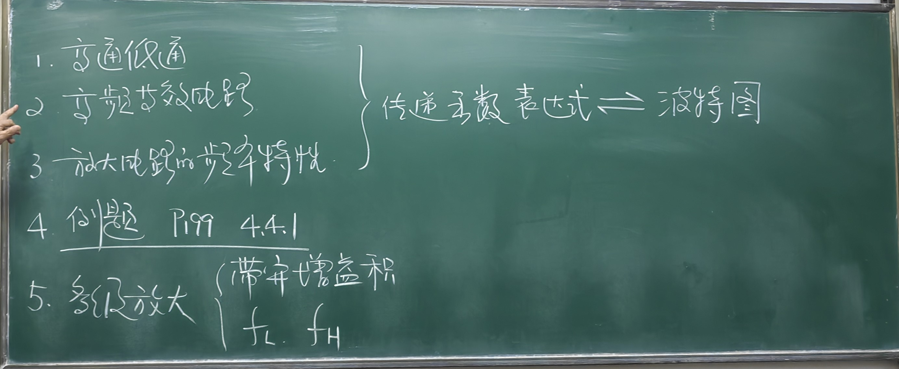

放大倍数

低通：
$$\dot{A}_{u}=\frac{1}{1+\frac{\omega_{\mathrm{L}}}{\mathrm{j}\omega}}=\frac{1}{1+\frac{f_{\mathrm{L}}}{\mathrm{j}f}}=\frac{\mathrm{j}\frac{f}{f_{\mathrm{L}}}}{1+\mathrm{j}\frac{f}{f_{\mathrm{L}}}}$$

高通：

==看P198面教材。==