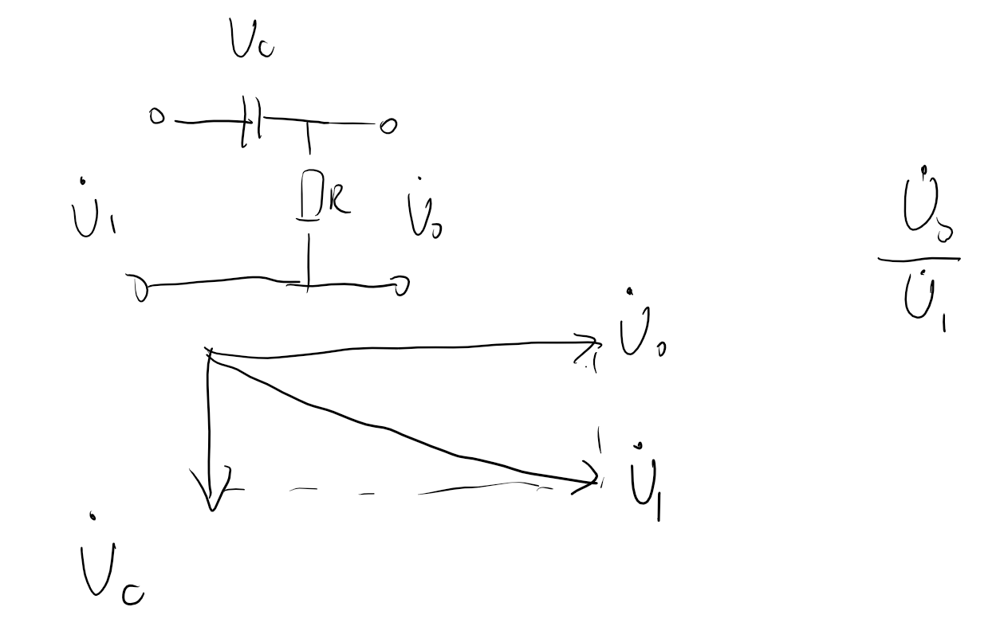
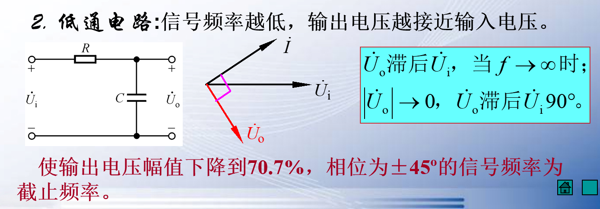
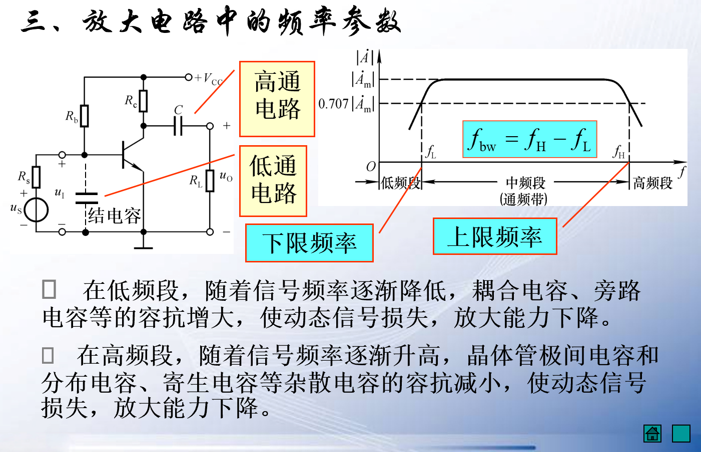

<!-- @import "[TOC]" {cmd="toc" depthFrom=1 depthTo=6 orderedList=false} -->

<!-- code_chunk_output -->

- [1 频率响应](#1-频率响应)
- [2 高通电路和低通电路](#2-高通电路和低通电路)
  - [2.1 高通电路](#21-高通电路)
  - [2.2 低通电路](#22-低通电路)

<!-- /code_chunk_output -->

## 1 频率响应

我们先前讨论的问题是基于电流电压等放大性问题，但是现在我们需要讨论固定幅值放大电路的频率问题。

本章着重讨论频率对放大倍数的影响，以及旁路电容等。耦合电容等的作用。

## 2 高通电路和低通电路

### 2.1 高通电路 

高频可以通过高频率的电路

这种电路也成为移相电路。

### 2.2 低通电路  

放大频率只能存在在一定范围。

中间可以通过的频率称为*通频带*。

