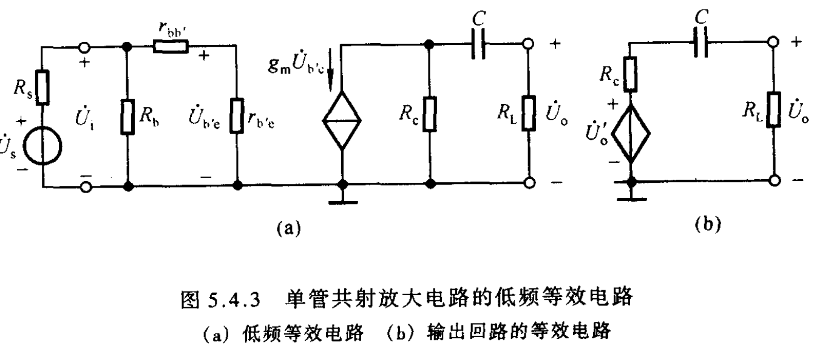
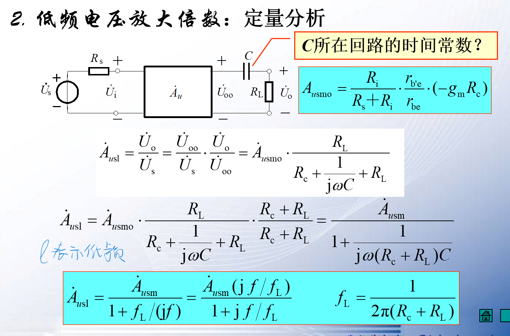
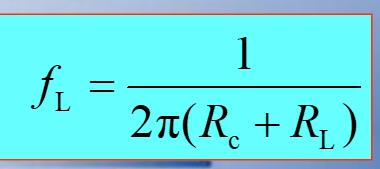
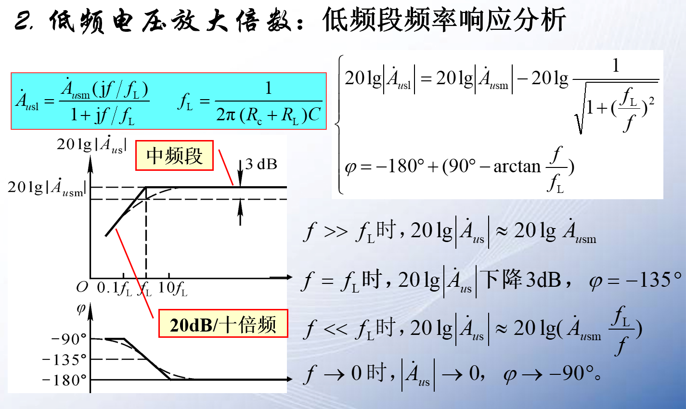
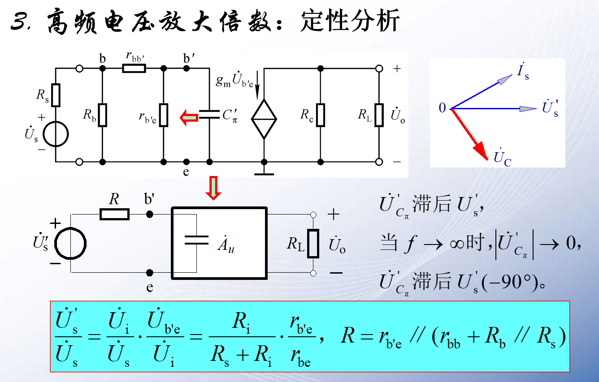
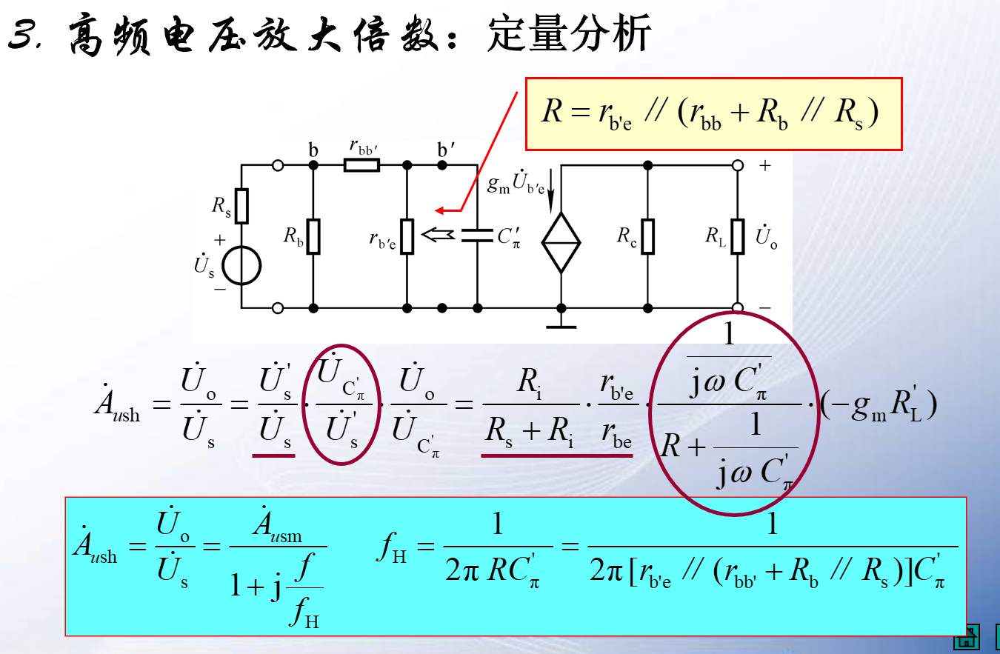
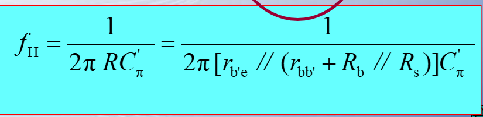
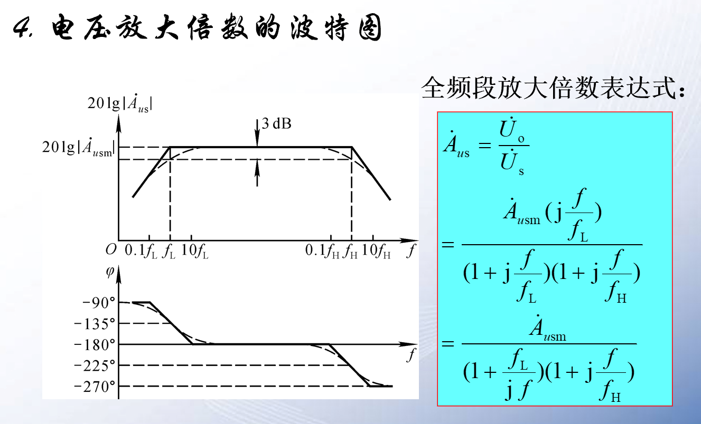
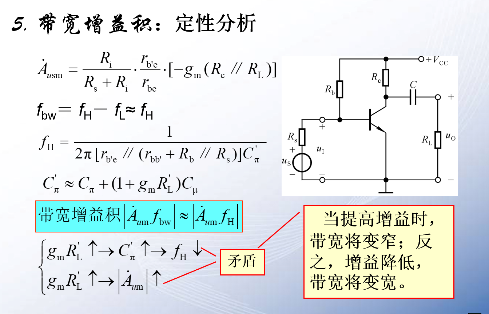
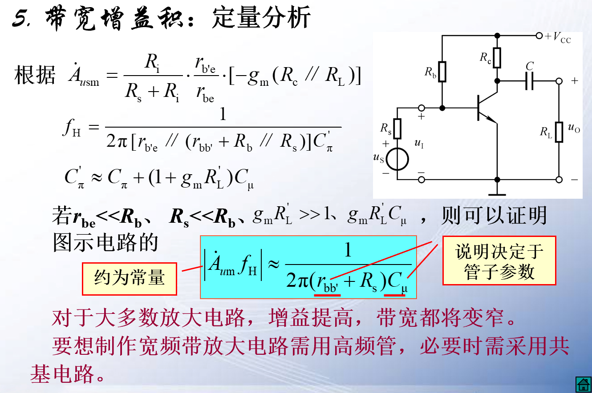

# 单管共射放大电路的频率响应

**根据前面对高频等效电路以及高通和低通的分析，我们对单管共射放大电路的频率响应分开进行分析：**

我们针对之前的经验对该电路进行低频和高频分析。

低频的时候$C_{\pi}$没有作用相当于开路。

## 1 中频电压放大倍数

$A_{usm}$表示中频段最大放大倍数

## 2 低频电压放大倍数  

**戴维南定理**

==电路的最低频率，也就是高通电路的截止频率。==

## 3 高频电压放大倍数

## 4 波特图  

相频特性，横轴角度$-180^\circ$

## 5 带宽增益积 

