# 反馈的概念  

<!-- @import "[TOC]" {cmd="toc" depthFrom=1 depthTo=6 orderedList=false} -->

<!-- code_chunk_output -->

- [反馈的概念](#反馈的概念)
  - [1 反馈的概念](#1-反馈的概念)
  - [2 正反馈与负反馈](#2-正反馈与负反馈)
  - [3 直流反馈和交流反馈](#3-直流反馈和交流反馈)
  - [4 局部反馈和级间反馈](#4-局部反馈和级间反馈)
  - [5 反馈的判断](#5-反馈的判断)
    - [5.1 反馈的判断](#51-反馈的判断)
    - [5.2 正负反馈的判断](#52-正负反馈的判断)

<!-- /code_chunk_output -->

---

## 1 反馈的概念  

放大电路
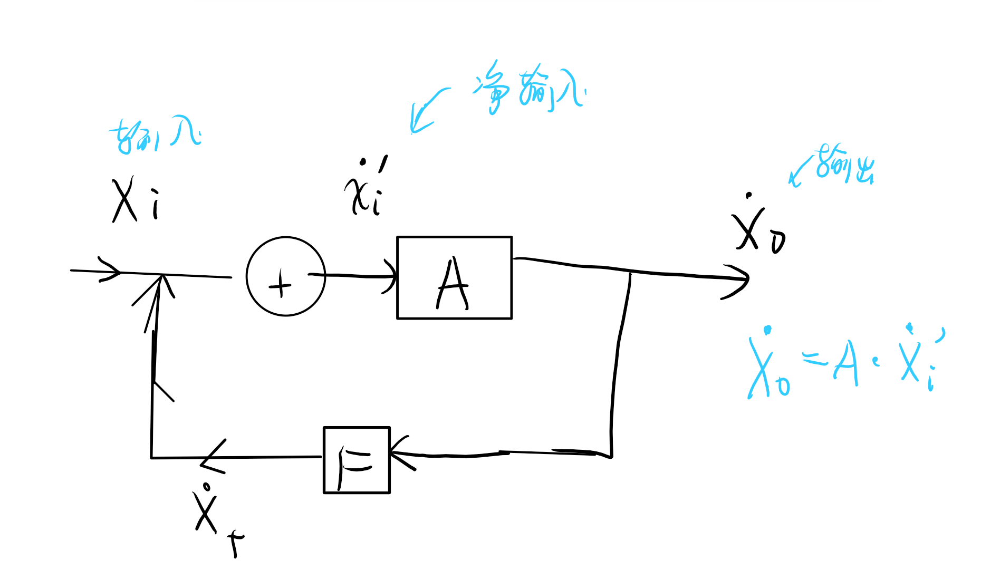

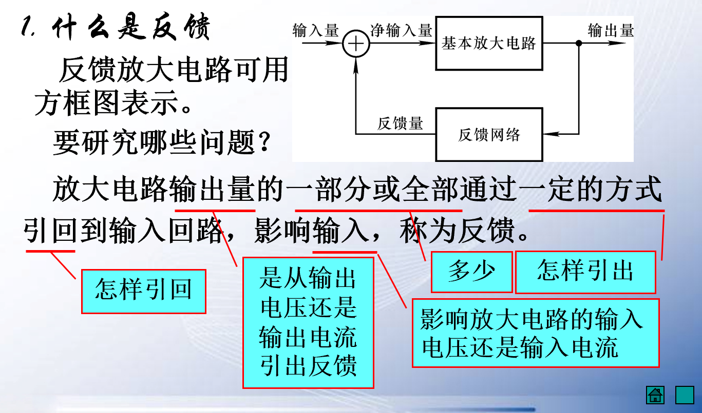

我们把输出量拿了一部分引回输入回路，这种称为反馈。

## 2 正反馈与负反馈

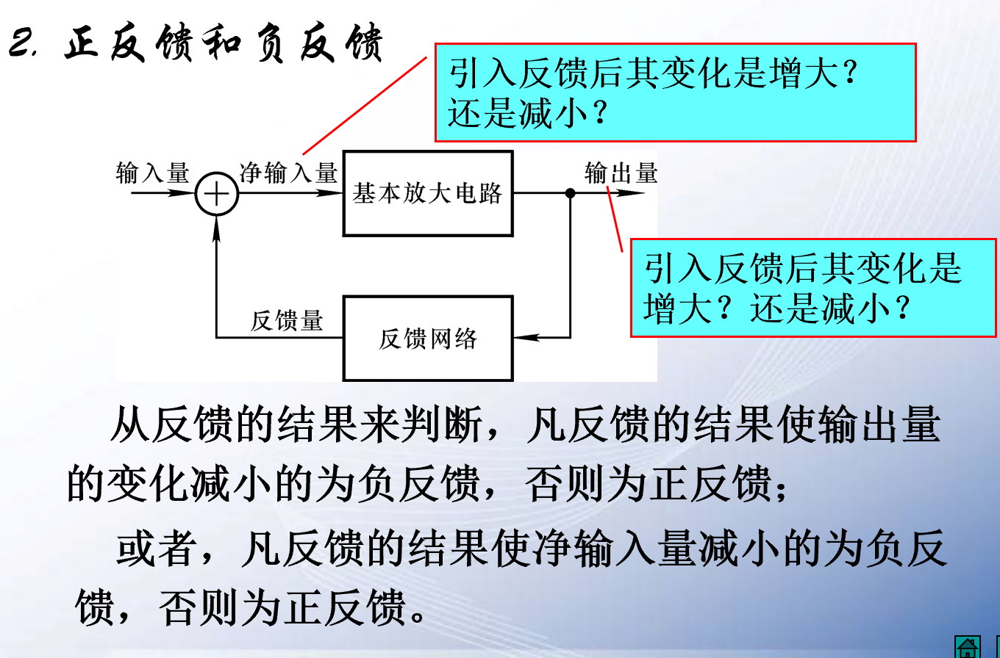

- 正反馈：使输出量的变化增大，使净输入量增加。
- 负反馈：使输出量的变化减小，使净输入量减小。

**有反馈是闭环，无反馈是开环**

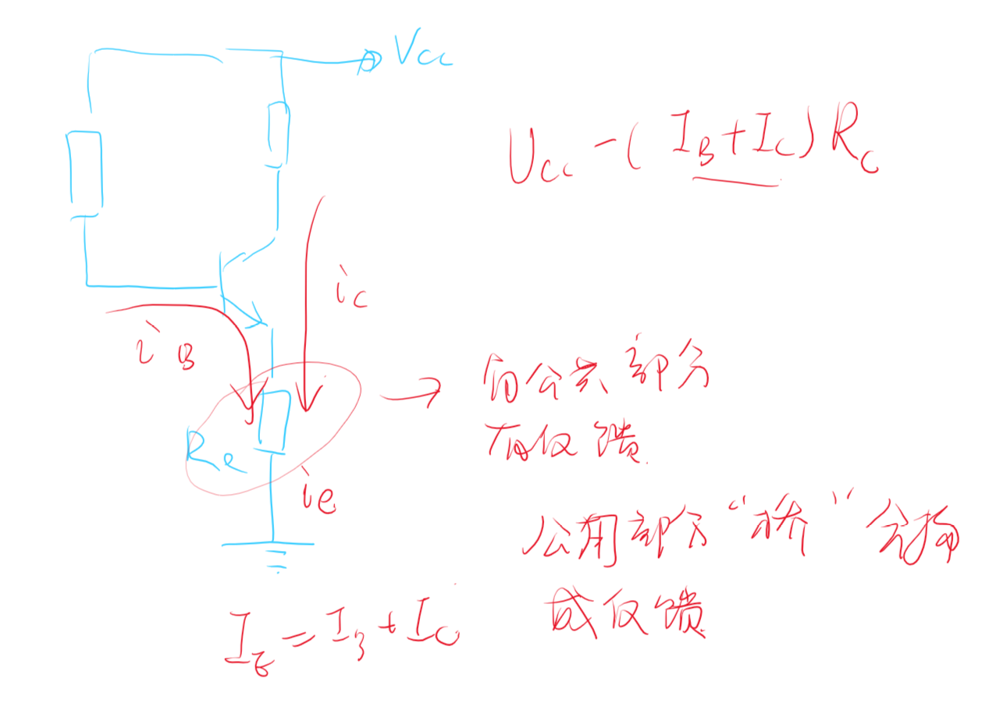

## 3 直流反馈和交流反馈  

这种公共部分还可以形成直流反馈和交流反馈：
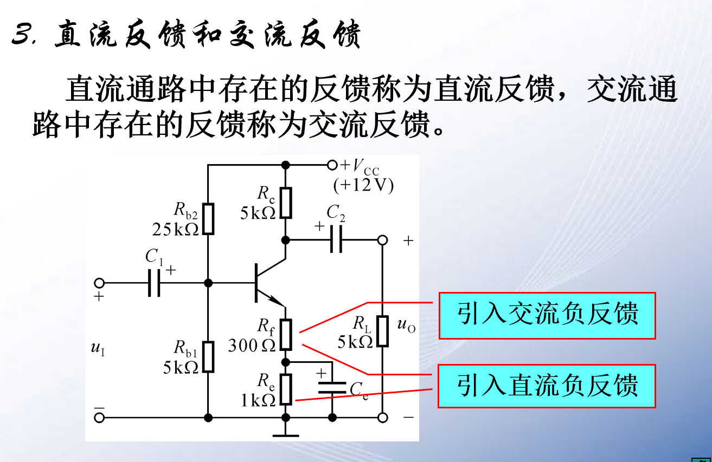

## 4 局部反馈和级间反馈  

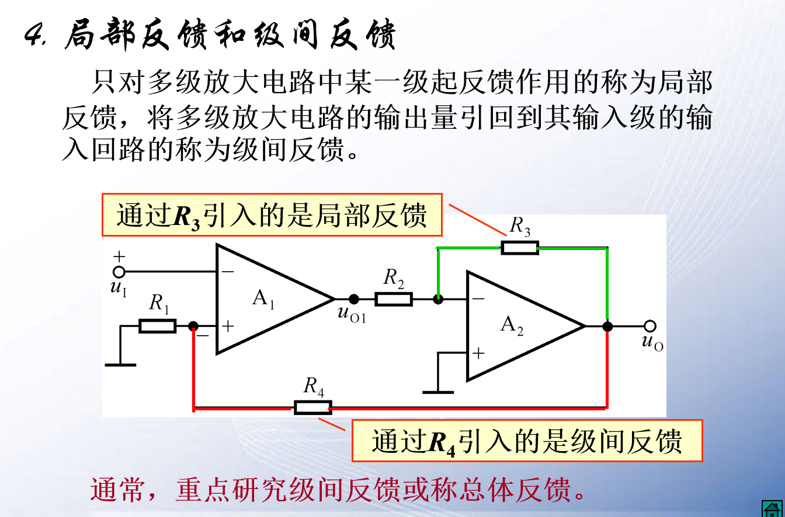

- 级间反馈：第二级和第一级之间的反馈
- 局部反馈：在本级之间

我们有时值判断级间反馈二忽略局部反馈。

## 5 反馈的判断  

### 5.1 反馈的判断
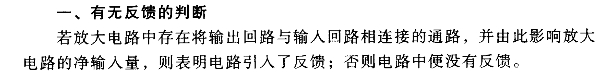

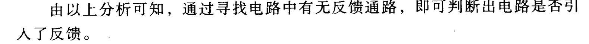

有无反馈通路来判断反馈。

### 5.2 正负反馈的判断  

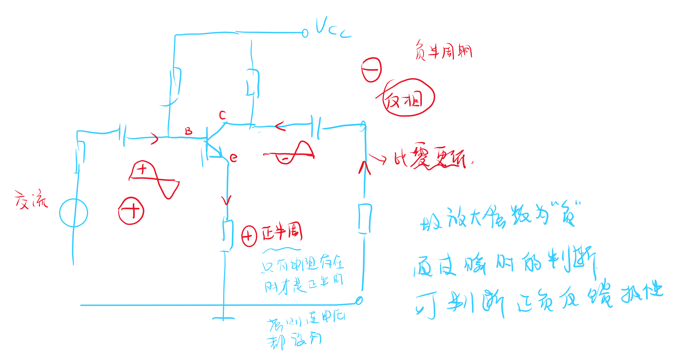
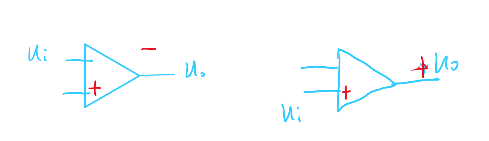

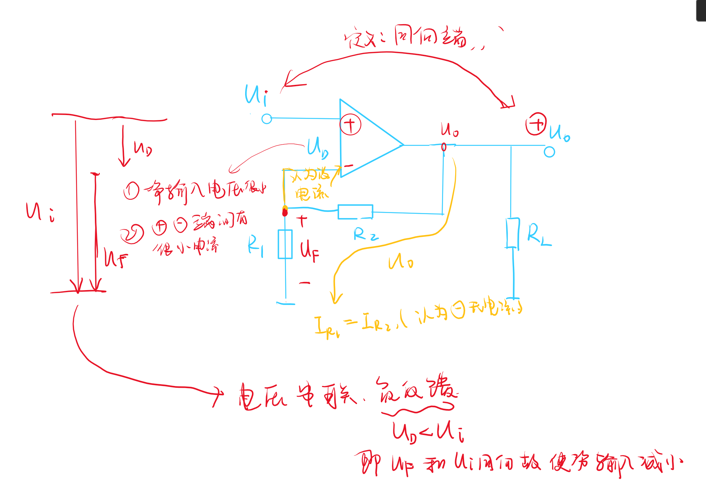

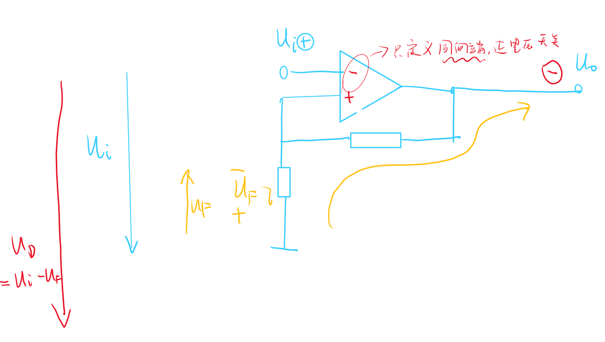

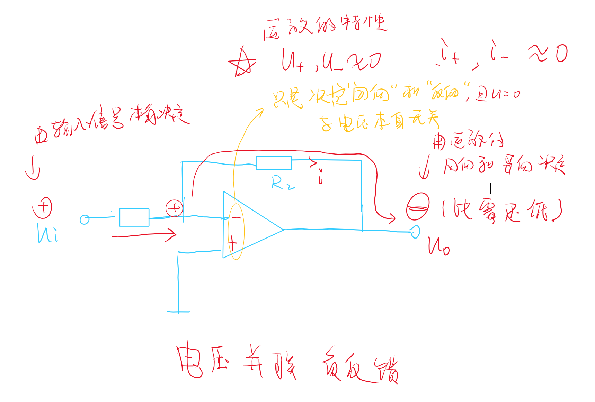