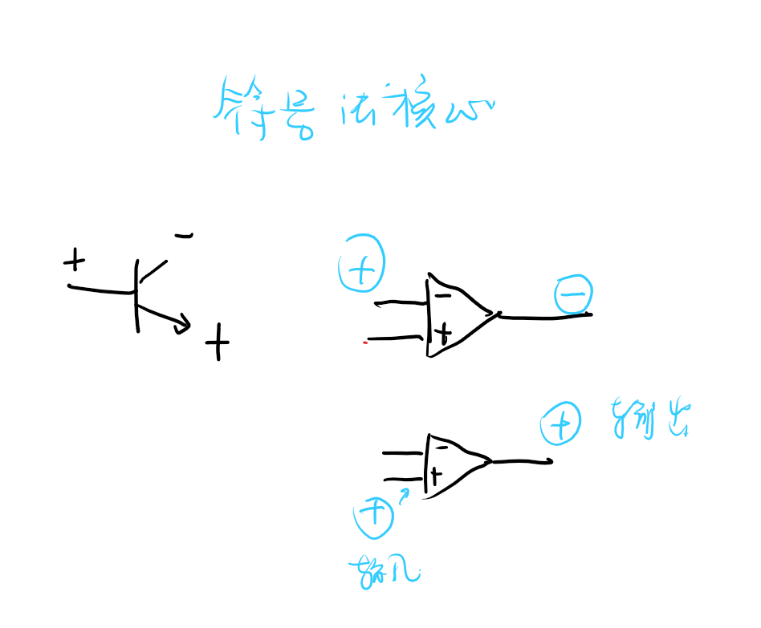
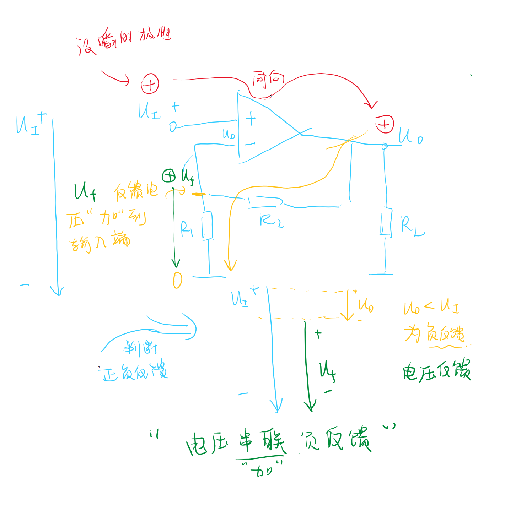
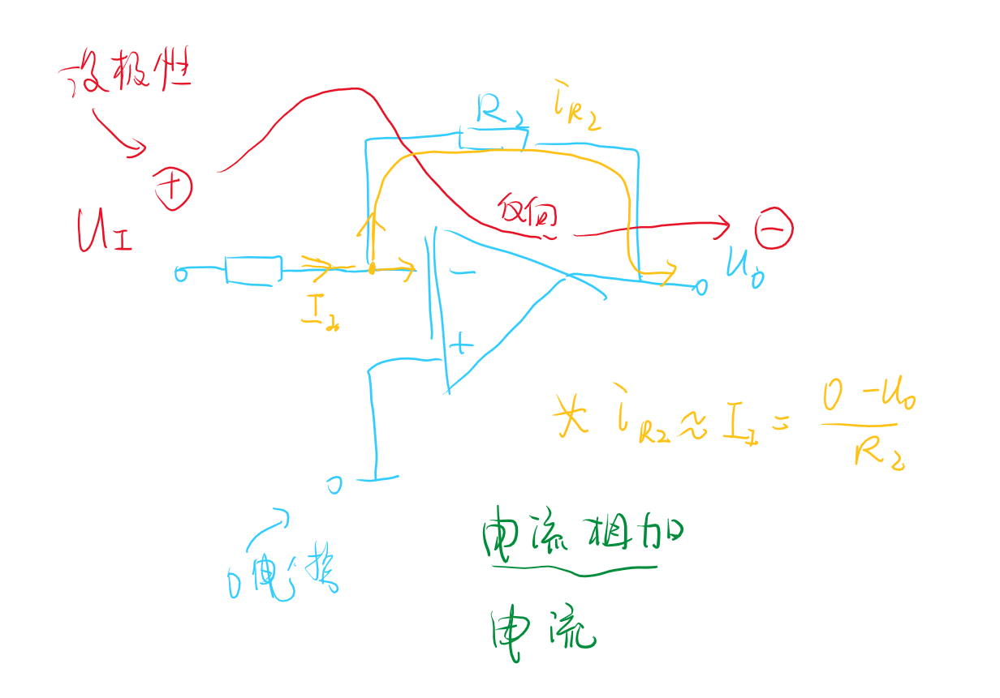
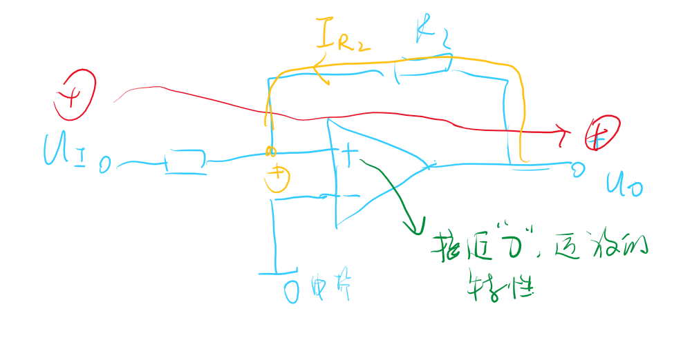

# 反馈的概念  

<!-- @import "[TOC]" {cmd="toc" depthFrom=1 depthTo=6 orderedList=false} -->

<!-- code_chunk_output -->

- [反馈的概念](#反馈的概念)
  - [1 反馈的概念](#1-反馈的概念)
  - [2 正反馈与负反馈](#2-正反馈与负反馈)
  - [3 直流反馈和交流反馈](#3-直流反馈和交流反馈)
  - [4 局部反馈和级间反馈](#4-局部反馈和级间反馈)
  - [5 反馈的判断](#5-反馈的判断)
    - [5.1 反馈的判断](#51-反馈的判断)
    - [:star: 5.2 正负反馈的判断](#star-52-正负反馈的判断)
      - [符号法/瞬时极性法](#符号法瞬时极性法)
      - [一些例子](#一些例子)
    - [:star:判断方法](#star判断方法)

<!-- /code_chunk_output -->

---

## 1 反馈的概念  

放大电路

我们把输出量拿了一部分引回输入回路，这种称为反馈。

## 2 正反馈与负反馈

- 正反馈：使输出量的变化增大，使净输入量增加。
- 负反馈：使输出量的变化减小，使净输入量减小。

**有反馈是闭环，无反馈是开环**

## 3 直流反馈和交流反馈  

这种公共部分还可以形成直流反馈和交流反馈：

## 4 局部反馈和级间反馈  

- 级间反馈：第二级和第一级之间的反馈
- 局部反馈：在本级之间

我们有时值判断级间反馈二忽略局部反馈。

## 5 反馈的判断  

### 5.1 反馈的判断

有无反馈通路来判断反馈。

### :star: 5.2 正负反馈的判断  

#### 符号法/瞬时极性法

#### 一些例子  

### :star:判断方法
**方法**
- 找到信号通道
- 找反馈路径
  - 找输出回路和输入回路的交集（公共部分，比如公共电阻，或者连接两个回路的桥电阻，有公共部分就有反馈）
- [符号法](#符号法瞬时极性法)判断正负反馈
- 判断反馈的来源&电压反馈还是电流反馈（输出电压还是输出电流。来源是电流就是电流反馈，是电压就是电压反馈）
- 串并联反馈判断（取决于反馈信号;电压相加$\rightarrow$串联 ，电流相加$\rightarrow$并联）

总体结构
[电流&电压]-[串联&并联]-[正反馈&负反馈]

---

正&负反馈$\Rightarrow$取决于符号法
电压&电流反馈$\Rightarrow$取决于输出信号
串联&并联$\Rightarrow$取决于反馈信号

---

