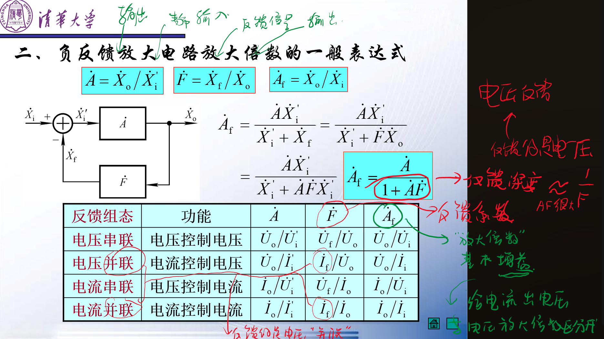

# 反馈阻态的判断  

<!-- @import "[TOC]" {cmd="toc" depthFrom=1 depthTo=6 orderedList=false} -->

<!-- code_chunk_output -->

- [反馈阻态的判断](#反馈阻态的判断)
    - [:star:判断方法](#star判断方法)

<!-- /code_chunk_output -->

---

### :star:判断方法
**方法**
- 找到信号通道
- 找反馈路径
  - 找输出回路和输入回路的交集（公共部分，比如公共电阻，或者连接两个回路的桥电阻，有公共部分就有反馈）
- [符号法](#符号法瞬时极性法)判断正负反馈
- 判断反馈的来源&电压反馈还是电流反馈（输出电压还是输出电流。来源是电流就是电流反馈，是电压就是电压反馈）
- 串并联反馈判断（取决于反馈信号;电压相加$\rightarrow$串联 ，电流相加$\rightarrow$并联）

总体结构
[电流&电压]-[串联&并联]-[正反馈&负反馈]

---

正&负反馈$\Rightarrow$取决于符号法
电压&电流反馈$\Rightarrow$取决于输出信号
串联&并联$\Rightarrow$取决于反馈信号

---

