# 反馈的计算
<!-- @import "[TOC]" {cmd="toc" depthFrom=1 depthTo=6 orderedList=false} -->

<!-- code_chunk_output -->

- [反馈的计算](#反馈的计算)
  - [1 比例运算电路](#1-比例运算电路)
    - [1.1 反相输入](#11-反相输入)
      - [1.1.1 例题](#111-例题)
    - [1.2 同向输入](#12-同向输入)
  - [2 加减运算电路](#2-加减运算电路)
    - [2.1 反相求和](#21-反相求和)
    - [2.2  同相求和](#22--同相求和)
    - [2.3 加减运算](#23-加减运算)
    - [考点](#考点)
  - [3 积分电路](#3-积分电路)

<!-- /code_chunk_output -->

## 1 比例运算电路 

### 1.1 反相输入

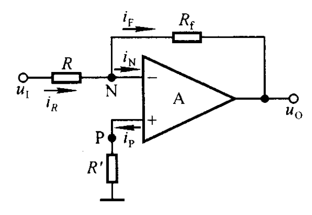

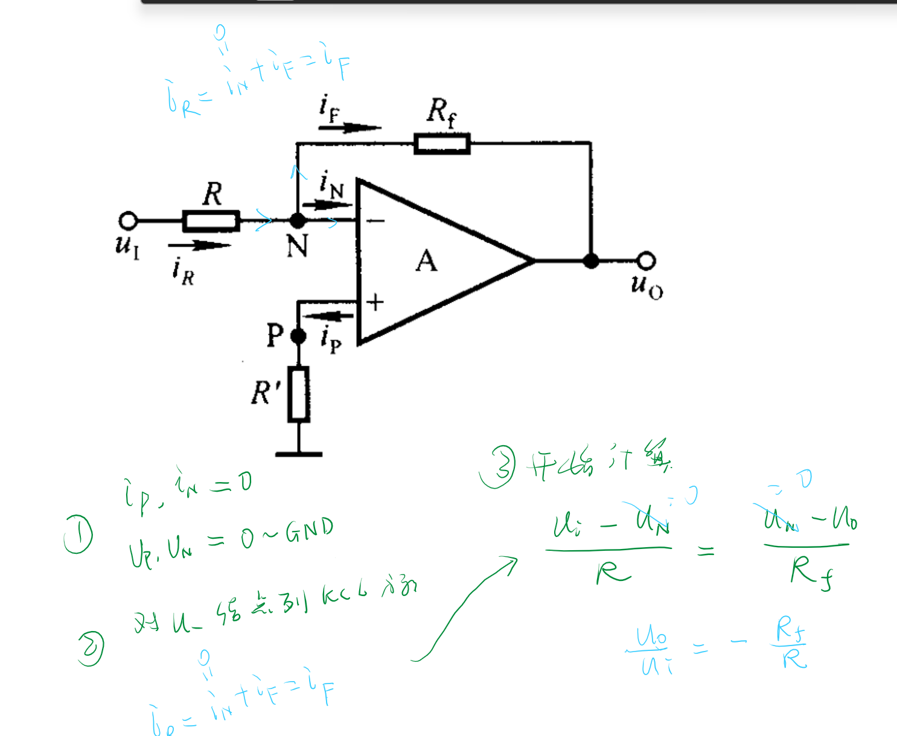

$R'$称为平衡电阻
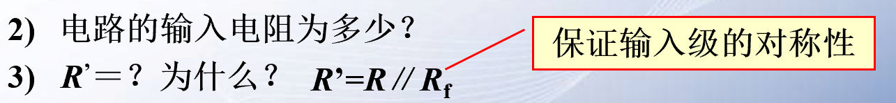

#### 1.1.1 例题

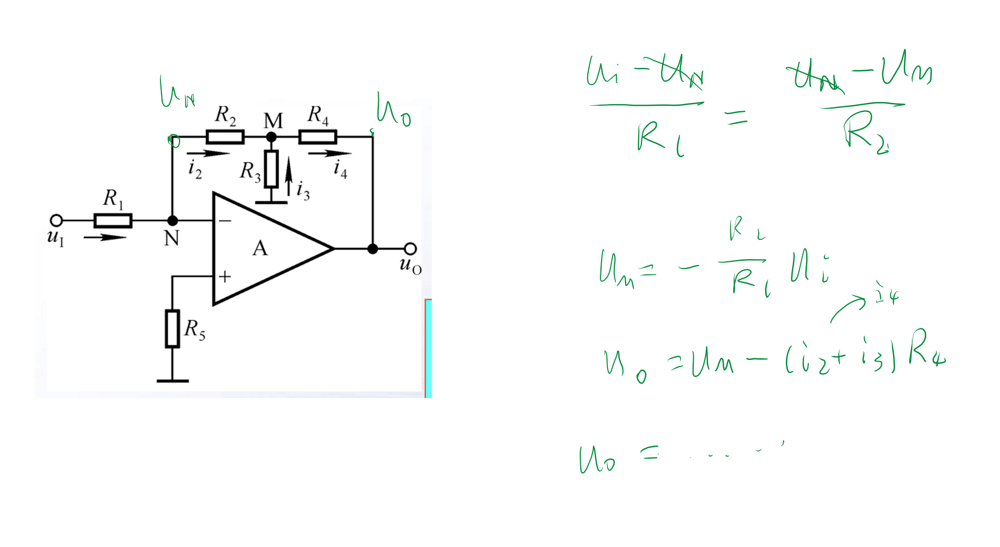

### 1.2 同向输入

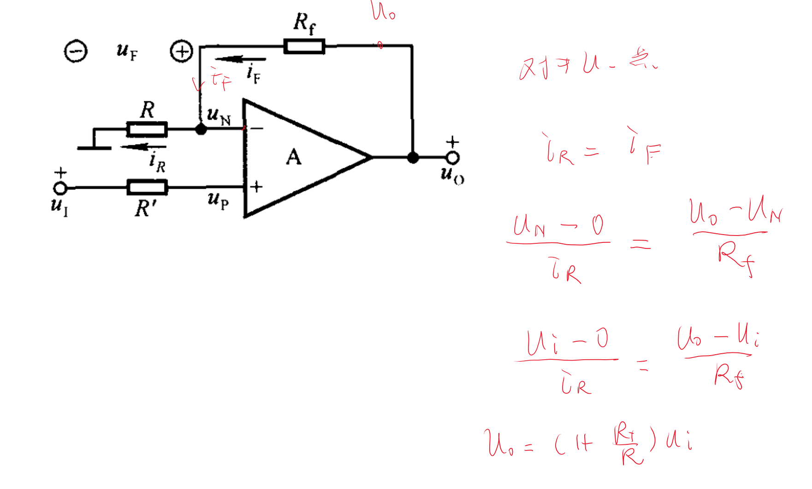
$$u_N = u_P = u_I$$

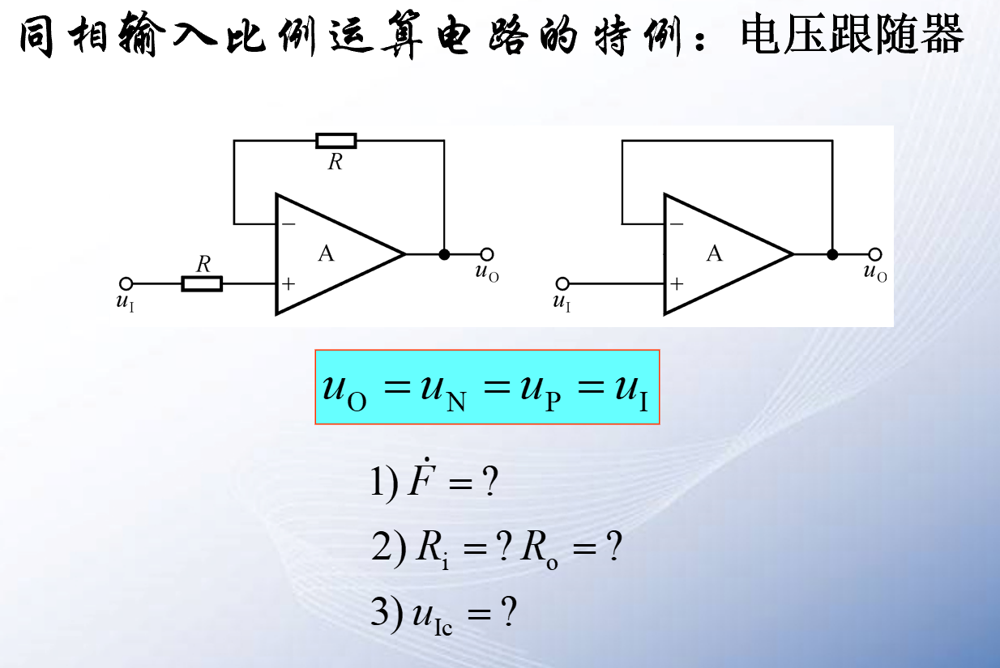

## 2 加减运算电路  

### 2.1 反相求和 

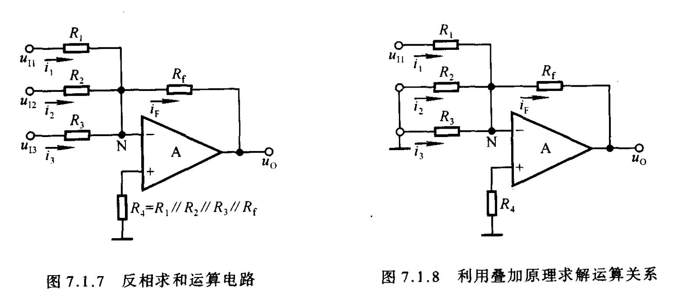

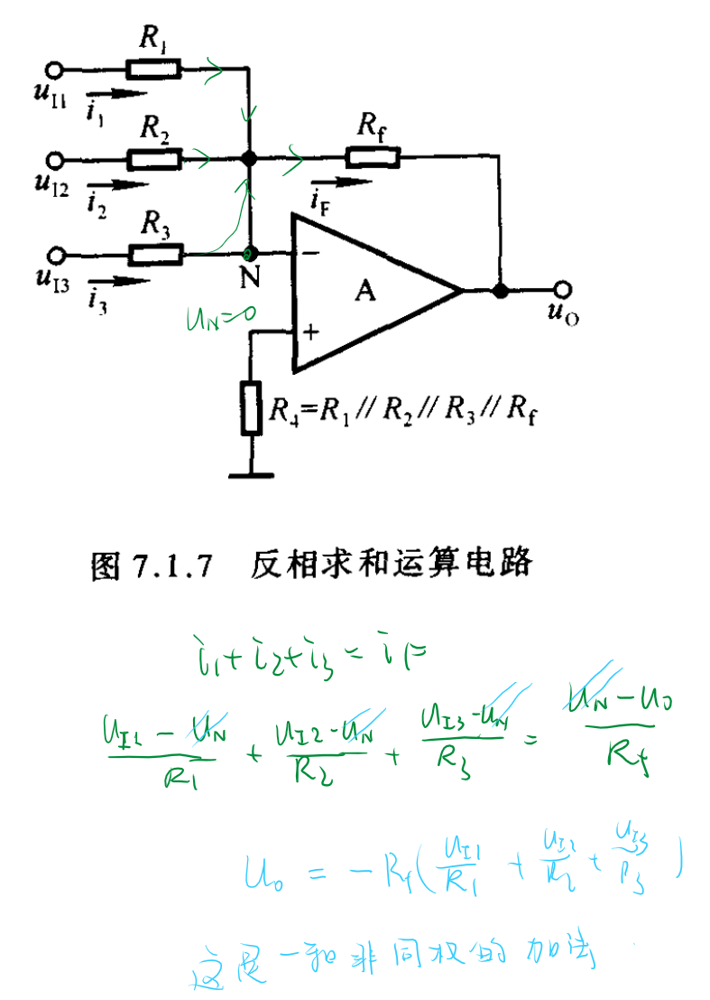

### 2.2  同相求和

:star:==节点电压法==

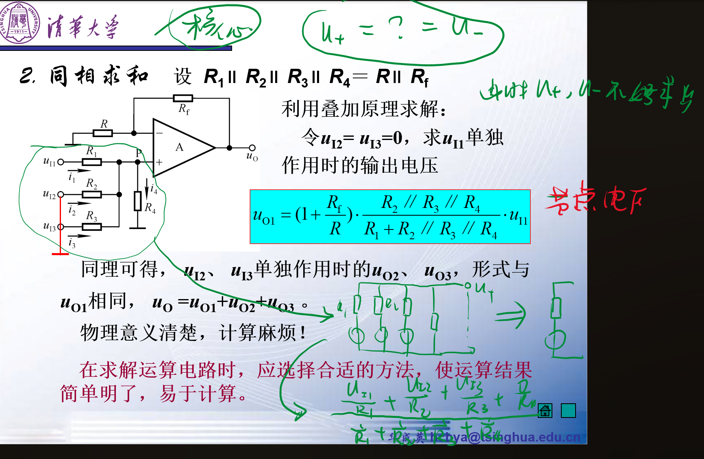

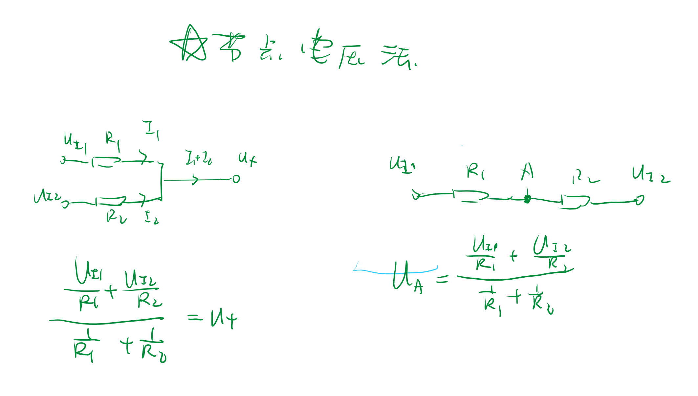

### 2.3 加减运算

**考点**

### 考点

两个电路图是考点。
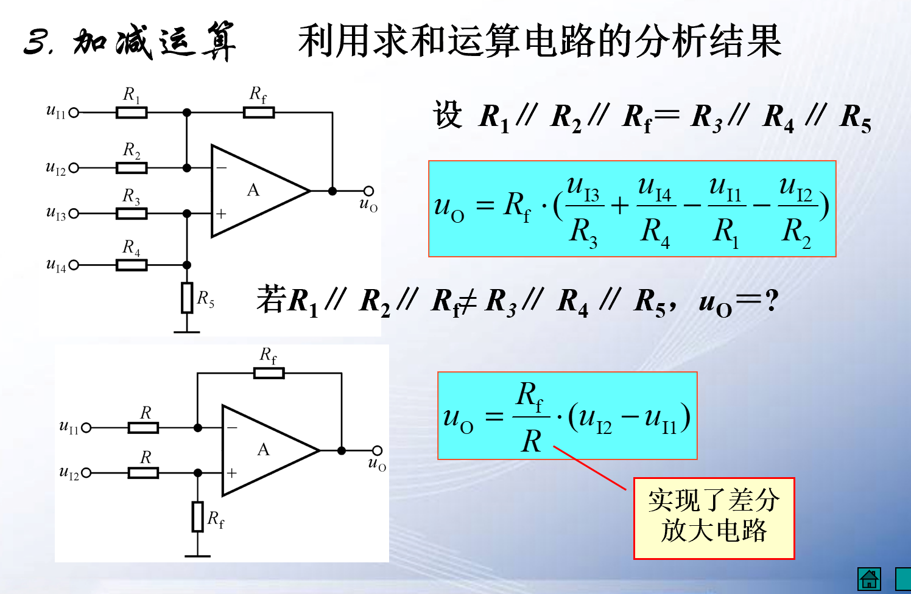
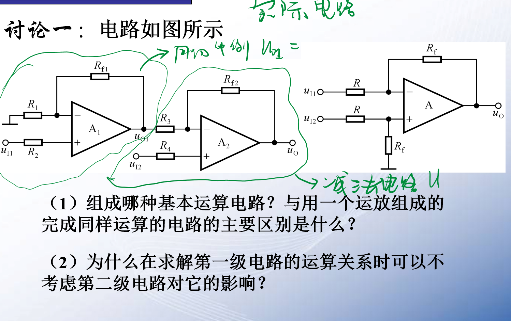

+虚短和续断的概念填空。

## 3 积分电路 

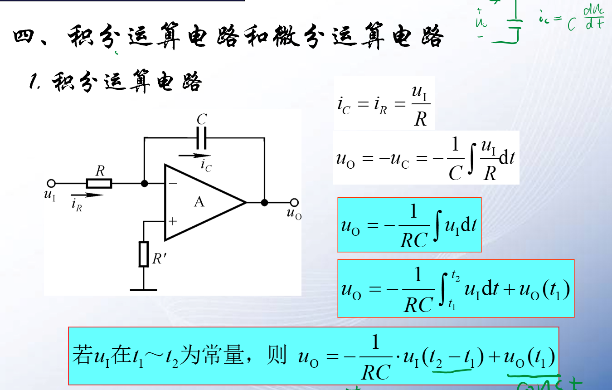

