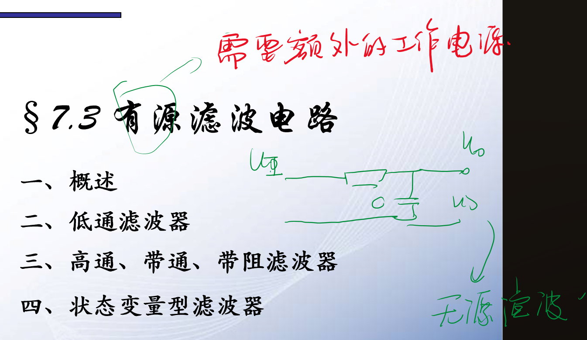
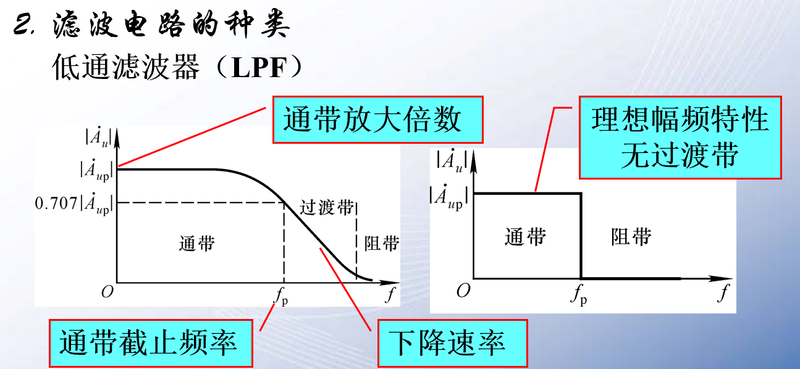
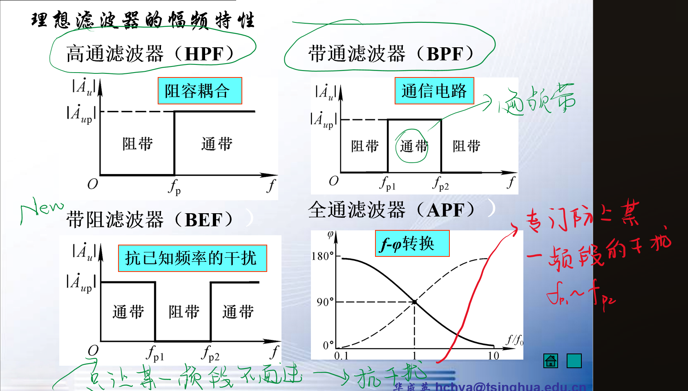
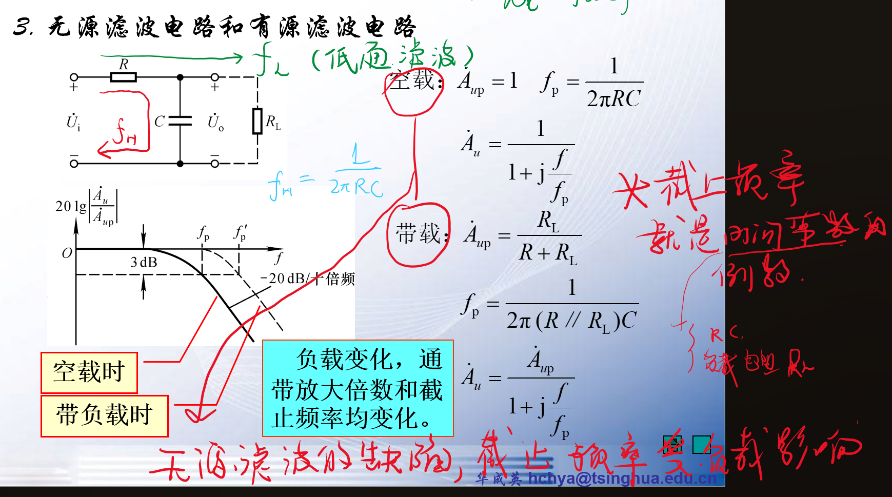
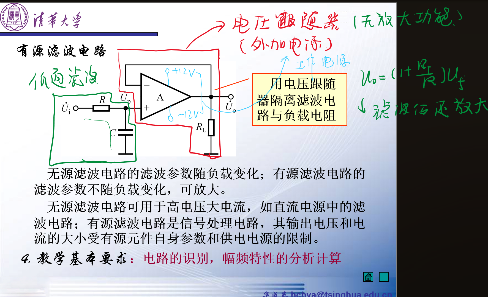

# 有源滤波

<!-- @import "[TOC]" {cmd="toc" depthFrom=1 depthTo=6 orderedList=false} -->

<!-- code_chunk_output -->

- [有源滤波](#有源滤波)
  - [1 概念](#1-概念)
  - [2 无源滤波的缺陷](#2-无源滤波的缺陷)
  - [3 有源滤波](#3-有源滤波)

<!-- /code_chunk_output -->

## 1 概念

1. 高通：LPF
2. 低通：HPF
3. 带通：BPF
4. 带阻滤波：BEF
5. 全通滤波：APF

## 2 无源滤波的缺陷

## 3 有源滤波  

