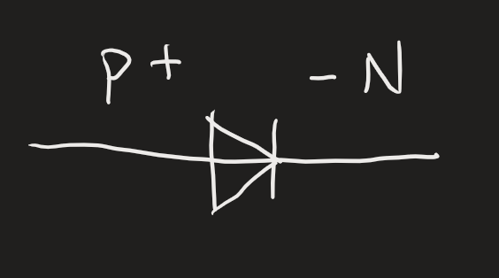
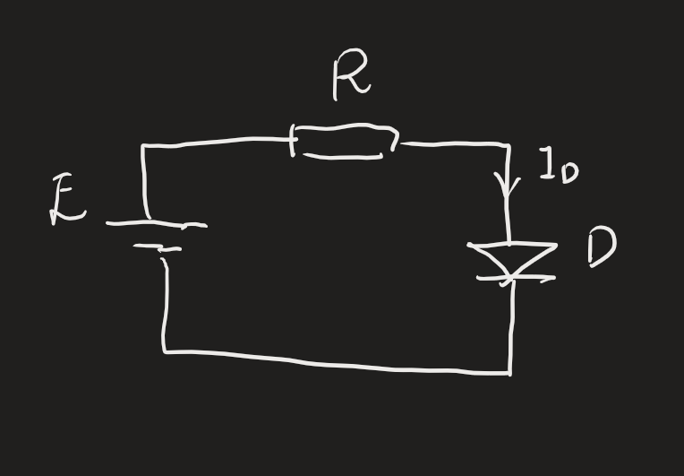
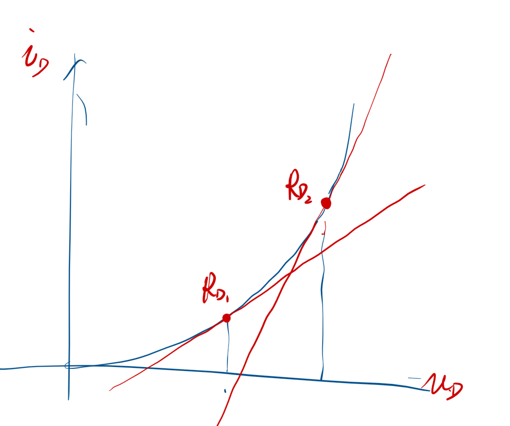
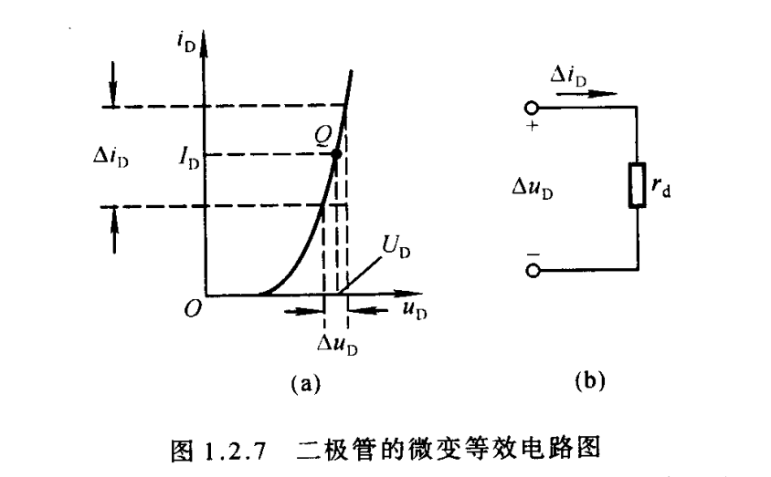

# 半导体二极管  

将PN结进行封装起来，引出两个引脚，形成了二极管。并且对正负极进行标记。两个引脚称为正极和负极。

## 二极管常见结构  
- 点接触型（高频二极管）
- 面接触型（整流二极管，大电流）
- 平面型

## 二极管的伏安特性  

*死区电压就是开启电压，具体值难以预测*

- 反向击穿
  - 雪崩击穿
  - 齐纳击穿

我们总结出了一个经验公式（开启电压后）
$$i =I_S(e^{\frac{u}{U_r}}-1)$$
半导体材料受到温度影响很大，所以不同环境，不同温度下曲线都可能变化。
死区电压会产生压降
导通后非理想二极管也会有导通压降
## 二极管等效电路

当电路中二极管两侧电压远大于启动电压，二极管计算可以简化成理想二极管，误差较小

## 二极管微变等效电路

二极管的电路为非线性电路，高次电路，我们使用图解法。

首先当二级管画正向电压并且导通时，将会有电流，（该点对应为Q点）此时可以计算出一个电阻$r_d$，若在此时给一个微小的变化量，可以以用该点的切线今昔计算，**在这个微小的范围中**二极管等效为一个*动态电阻*$r_d=\frac{\Delta u_D}{\Delta i_D}$整体电路称为：二极管微变等效电路

显然不同的微小范围对应的动态电阻不同
由于用直线拟合指数函数所以只在**微小范围**内有用

当我们将这个微小的变动作为一个正弦输入量，将会得到：

### 动态电阻，交流电阻
$R= \frac{\Delta U}{\Delta I}$我们在动态分析中，非线性关系（第一个馒头救命，第二个馒头不饿，第三个馒头开心，同样的馒头作用不同）动态是基于直流，**动态的动是基于静态之上**。

此时总体上依然是直流，只不过存在交流信号。此时二极管在这个动态电路中对小的交流信号产生作用。

