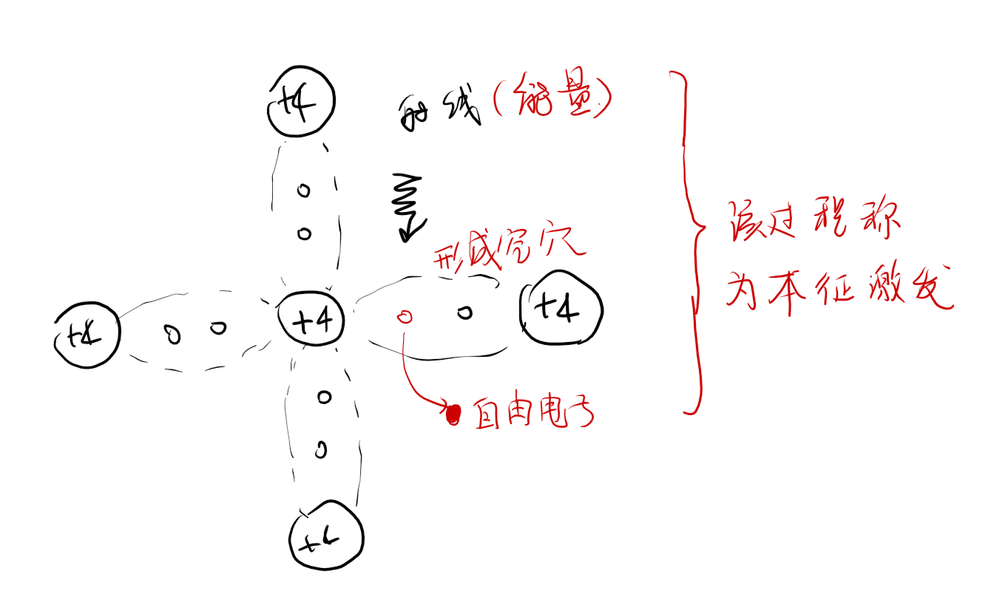
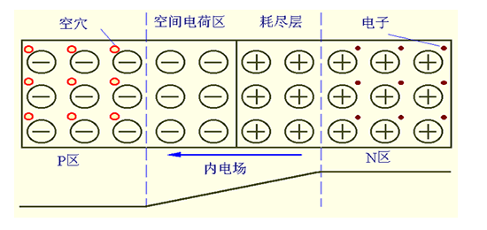

# 半导体器件

## 本征半导体  （晶片）

**纯净的具有晶体结构的半导体称为本征半导体**  

- 本征半导体的要求
  
    - 半导体
    - 晶体

- 载流子
    - 自由电子
    - 阴阳离子
    - 空穴
    - ...

- 本征半导体具有两种载流子
    - 自由电子
      - 被激发的电子可能被原子核吸收或者碰撞其他电子，总之处于一个动态平衡之中  
    - 空穴 
      - (空穴可以填入自由电子，因此可以载电荷移动，多个空穴作用即可移动<mark>从高电位到低电位</mark>)

- 本征激发

  - 受到环境辐射影响
  - 

$$n_{i}=p_{i}=K_{1}T^{\frac{3}{2}}e^{\frac{-E_{GO}}{(2KT)}}$$

绝对0度的时候没有热运动，因此为绝对绝缘

## 杂质半导体

- 定义

  - 我们在晶体的结构基础上参加合适的杂质元素形成N型半导体和P型半导体
  - 注：也需要晶体结构

杂质半导体有两种常见的类型

- 杂质半导体

  - [N型半导体](#n型半导体)
  - [P型半导体](#p型半导体)

本征激发在杂质半导体之中并没有停止，只不过此时空穴载流子和自由电子载流子数量不同。自由电子载流子多称为多子，反则称为少子

- 杂质半导体的本征激发

  - 多子：占比多的为多数载流子

    - P型半导体的空穴
    - N型半导体的电子
  - 少子：占比少的为少数载流子

- **载流子的运动**

  - 热运动：半导体内的自由电子和空穴始终在进行着无规则的热运动，热平衡时热运动是随机的，载流子热运动的平均结果为净电流为0。
  - 扩散运动：当半导体内载流子浓度存在差异，载流子将从浓度高的区域自发地向浓度低的区域扩散，进而形成扩散运动。
  - 漂移运动：半导体内存在电场时，自由电子和空穴会在电场力的作用下产生运动，此即为载流子的漂移运动。

### N型半导体

### P型半导体

**无论是P型半导体还是N型半导体都呈为电中性**

## PN结 （空间电荷区，耗尽层）

当两种半导体靠近时候，载流子浓度存在差异，N区域的电子势必会想P区的空穴扩散，刚开始的扩散速率较快，然后随之平缓，最终处于平衡。
- 耗尽层

  - 两种载流子的复合，耗尽了载流子。

**内电场的出现导致了少子的漂移**最终导致动态平衡。  
由于本征激发的存在，半导体的导电性能与温度关系很大

### PN结的单向导电性

#### 导通状态
外接电场削减了内电场，使扩散增强

#### 截至状态  

### PN结的电容效应  
- 结电容
  - 势垒电容：反向电压，PN结变宽，电容效果变化
  - 扩散电容：正向电压，PN结变窄

